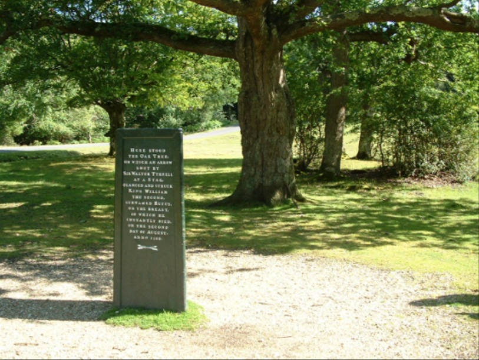

# A Prologue {-}

Good Morning! How are you doing? It's been great being part of the Analytical Community the last few years hasn't it? The excitement is everywhere about "big-data","data-science","MOOCs". I have been blown away by the talent being attracted into Analytics.One current trend is 'a shift from a desire to work for bigger name brand companies like Facebook or Google, to more mission-driven organizations attempting to make an impact on society. Whether it is curing cancer, conserving energy, tracking infectious disease or personalizing education, more data scientists are becoming interested in trying to make the world a  better place' [@nuggets].

> "If the results disagree with informed opinion, do not admit a simple logical explanation, and do not show up clearly in a graphical presentation, they are probably wrong. There is no magic about numerical methods, and many ways in which they can break down. They are a valuable aid to the interpretation of data, not sausage machines automatically transforming bodies of numbers into packets of scientific fact"
>
> --- F.H.C. Marriott [@Marriott1974, page 89]


My thesis is about Data Analytics in a Business Environment. In particular how to empower colleagues to use Data Analytics in problem solving. I work in the London Insurance Markets and am certainly not in a position to help cure cancer or Global Warming! I do interact everyday with colleagues as they process, analyse and act on their data. This thesis is very much about solving the worlds business problems, however small or one-off!

In this document, I explore the innovative R Studio technology and the economic rationale for embracing it. For me, R Studio is a 3D printer for Analytics projects. It empowers the developer and the user of Analytics projects to collaborate and develop customised, interactive tools. The flexible and powerful R expression language allows these apps to become super sophisticated if needed.

I would like to dedicate my thesis to Sir Walter Tyrell of England. Misadventure is a part of everyone's life but not many people accidentally kill a king!!! The tree responsible is still alive in the New Forest in England!

(ref:Prologue1) "Here stood the Oak Tree, on which an arrow shot by Sir Walter Tyrell at a stag, glanced and struck King William the Second, surnamed Rufus, on the breast, of which he instantly died, on the second day of August, anno 1100"

```{r Walter,echo=FALSE, fig.cap='(ref:Prologue1)',fig.align='center'}

```


