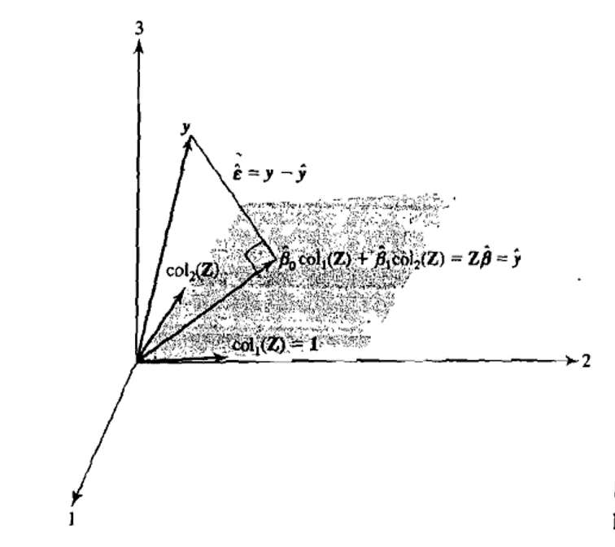
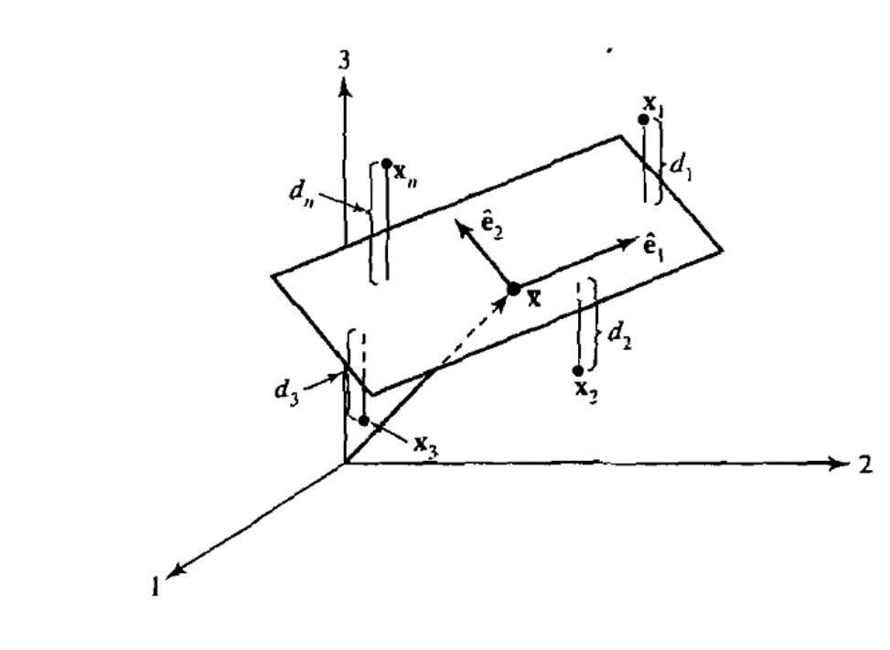

# Multivariate Statistical Models {#Models}

The following sections on Multivariate Models are drawn from @johnson2014applied. The proofs for results stated in the [Linear Regression Section](#LinReg) are found in Chapter 7, the proofs for the [Principal Component Section](#PCA) are found in Chapters 8 & 8A, those for the [Canonical Correlation Analysis](#Canonical) in Chapter 10, those for [Factor Analyis](#Factor) in Chapter 9. 

**Estimating Best Linear Predictors**

In practice, the models we use to estimate best linear predictors make assumptions in addition to the population mean and covariance being finite. These assumptions vary from model to model. One practical reason for this is we do not have access to the population mean $\mu$ and covariance matrix $\Sigma$, but rather must make inferences based on sample estimates using the data available.

In the subsequent [Data](#Data) and [Analysis](#ProfileAnalysis) chapters, I want to investigate the best linear predictor of a response variable using four distinct Multivariate Techniques. My general objective is to end up with models with a limited number of factors (ie. data reduction) that offer significant insights into the data (ie ease of interpretation) and are technically sound (ie. statistical model fitting and selection).

As we shall see each approach emphasises a different aspect of the sample data. The Classical Linear Regression approach focuses on the sample mean, the Principal Component Analysis approach emphasises the sample covariance matrix and Factor Analysis is a mixture of both. 

## Classical Linear Regression {#LinReg}

**Analytical Properties**

A regression function is a conditional expectation. The expectation is calculated for one variable $Y$, the response, conditional on the values for the other "explanatory" variables $Z_{1},Z_{2},...,Z_{r}$. It need not be linear but always predicts $Y$ with smallest MSE (ref?). The regression function is written $E[Y \vert Z_{1},Z_{2},...,Z_{r}]$.

We can motivate the form of the classical linear regression model with reference to the Multivariate Normal Distribution (ref @johnson2014applied, page 404, eqn. 7.51):

```{example, name="Regression Function for Multivariate Random variables"}
Let $Y$ and $Z_{1},Z_{2},...,Z_{r}$ be generated by a Multivariate Normal Distribution, ie.:

$$\begin{bmatrix}Y\\
Z_{1}\\...\\Z_{r}\end{bmatrix} \sim \mathcal{N}_{r+1}(\mu,\Sigma)$$

We can then infer the conditional distribution of $Y$ given $Z_{1},Z_{2},...,Z_{r}$. Using the notation of the previous section:

$$Y_{\vert Z_{1},Z_{2},...,Z_{r}} \sim \mathcal{N}_{1}(\mu_{Y}+\sigma_{XY}^{´}\sigma_{ZZ}^{-1}(Z-\mu_{Z}),\sigma_{YY}-\sigma_{ZY}^{´}\sigma_{ZZ}\sigma_{ZY})$$

We can then identify the regression function as a linear function of the vector of explanatory variables $Z$ plus a constant term:

$$E[Y \vert Z_{1},Z_{2},...,Z_{r}]=\mu_{Y}+\sigma_{XY}^{´}\sigma_{ZZ}^{-1}(Z-\mu_{Z})$$

By making the following definitions:

\begin{align} 
b_{Z} &:= \Sigma_{ZZ}^{-1}\sigma_{ZY}\\
b_{0} &:= \mu_{Y}-b_{Z}^{´}\mu_{Z}
\end{align} 

We can write the regression function in the following form:

$$E[Y \vert Z_{1},Z_{2},...,Z_{r}]=b_{0}+b_{Z}^´Z$$

$\square$

```


In the classical linear regression model, we call the linear predictor a mean effect.The response $Y$ is generated from the mean effect by adding an error term (see @johnson2014applied, page 362, eqn. 7.3). 

```{definition, LinReg, name="Classical Linear Regression Model"}
Let $Y$ be a univariate response variable whose relationship with r predictor variables $Z_{1},Z_{2},...,Z_{r}$ is under investigation. The classical Linear Regression Model is:

\begin{align} 
Y &= \beta_{0}+\beta_{1}Z_{1}+\beta_{2}Z_{2},...+\beta_{r}Z_{r}+\epsilon \\
[Response] &= [Mean]+[Error]
\end{align} 

The following additional assumptions are made. For a Random Sample of size n, we assume:

The error term \epsilon has zero expectation:
$$E[\underset{(n \times 1)}{\epsilon}]=\underset{(n \times 1)}{0}$$

The individual components of the error vector have equal variance and are mutually uncorrelated:

$$\underset{(n \times n)}{Cov(\epsilon)}=\sigma^2\underset{(n \times n)}{I}$$

The error vector is generated by a multivariate normal distribution:

$$\underset{(n \times 1)}{\epsilon} \sim \mathcal{N}_{n}(0,\sigma^2I)$$

$\square$

```

When fitting classical linear models, it is important to remember that the explanatory variables $Z$ are considered fixed but the parameter values $[\beta_{0},\beta_{1},..,\beta_{r}]$ need to be determined . The geometrical picture of a Classical Linear Regression model is as follows (see @johnson2014applied, page 367):

 ```{definition, name="Geometrical Picture of Linear Regression"}
The expected value of the response vector is:

$$E[Y]=X\beta=\begin{bmatrix}1 & Z_{11} & Z_{12} & ...& Z_{1r}\\1& Z_{21} & Z_{22} &... & Z_{2r}\\....&....&....&....&...\\1 & Z_{n1} & Z_{n2} &....&Z_{nr}\end{bmatrix}
                  \begin{bmatrix}\beta_{0}\\\beta_{1}\\...\\\beta_{r}\end{bmatrix}$$

This can be re-written as a sum of the columns of Z:

$$E[Y]=\beta_{0}\underset{(n \times 1)}{1}+ \beta_{1}\underset{(n \times 1)}{Z_{1}}+...\beta_{r}\underset{(n \times 1)}{Z_{r}}$$

Thus the linear regression model states that the mean vector lies in a hyperplane spanned by the r+1 measurment vectors. These vectors are fixed by the measurement data and model fitting corresponds to finding the parameter values 
$[\beta_{0},\beta_{1},..,\beta_{r}]$ which minimise the Mean Square Error of the sample data. 

The hyperplane is known as the model plane. 

$\square$

```
**Fitting Model**

Estimating the best linear predictor (aka. the mean effect) for a Classical Linear Regression model can be achieved with ordinary least squares (OLS). Geometrically the OLS estimation procedure finds sample estimates for the parameter values $[\beta_{0},\beta_{1},..,\beta_{r}]$ which place the response vector $y$ and a vector in the model plane as close together as possible. This corresponds to decomposing the response vector $y$ in terms of a projection onto the model plane (aka. the prediction vector) and a vector of residuals orthogonal to the model plane (aka. the residual vector)

(ref:LineRegression) A representation of OLS model fitting with three observations ($n=3$) of one explanatory variable ($col_{2}(Z)$). Reproduced from @johnson2014applied, Figure 7.1.

```{r LineRegression,echo=FALSE, fig.cap='(ref:LineRegression)',fig.align='center',dpi=20}

```

The following analytical result for OLS estimates can be derived (see @johnson2014applied, page 364, eqn. 7.1):

 ```{proposition, OLSReg, name="OLS Estimates of Linear Regression Model"}

The r+1 dimensional vector of sample estimates for the parameter values $\beta=[\beta_{0},\beta_{1},..,\beta_{r}]$ are denoted 
$\widehat{\beta}=[b_{0},b_{1},..,b_{r}]$. The OLS estiamtes of $\widehat{\beta}$:

$$\widehat{\beta}=(Z^´Z)^{-1}Z^´y$$

The n dimensional projection of the response vector onto the model plane is known as the prediction vector and denoted $\widehat{y}$. The OLS estimate is:

$$\widehat{y}=Z(Z^´Z)^{-1}Z^´y$$


The n dimensional vector of differences between the responses $y$ and the predictions $\widehat{y}$ is known as the residual vector and denoted $\widehat{\epsilon}$. The OLS estimate is:

$$\widehat{\epsilon}=(1-Z(Z^´Z)^{-1}Z^´)y$$.

$\square$

```


The ability of the best linear predictor to explain variations in the response vector is estimated using the Coefficient of Determination ($=\rho_{Y(Z)}^2$ see def. \@ref(def:rho) ). (For proof see @johnson2014applied, page 367, eqn. 7.9)

 ```{proposition, name="Measuring the Performance of Best Estimator"}

The orthogonality of $\widehat{\epsilon}$ and $\widehat{y}$ under OLS fitting allows the decomposition:

\begin{align}
\sum_{i=1}^{n}(y_{i}-\overline{y})^2 &= \sum_{i=1}^{n}(\widehat{y_{i}}-\overline{y})^2 + \sum_{i=1}^{n}(y_{i}-\widehat{y_{i}})^2 \\
[Total Sum of Squares] &= [Regression Sum of Squares]+[Residual Sum of Squares]
\end{align}

The coefficient of determination $R^2$ is calculated as follows:

\begin{align}
R^2 &= 1-\frac{\sum_{i=1}^{n}(y_{i}-\widehat{y_{i}})^2}{\sum_{i=1}^{n}(y_{i}-\overline{y})^2} \\
&=  \frac{\sum_{i=1}^{n}(\widehat{y_{i}}-\overline{y})^2}{\sum_{i=1}^{n}(y_{i}-\overline{y})^2} \\
&= [Regression Sum of Squares]/[Total Sum of Squares]
\end{align}

$\square$

```


If the model assumptions in definition \@ref(def:LinReg) are valid then the Sample Estimates of the model parameters have the following distributional properties (see @johnson2014applied, page 404, page 370, section 7.4):

 ```{proposition, OLSSampling, name="Sampling Properties of OLS Estimates"}

The parameter estimates $\widehat{\beta}$ have the follow properties:

\begin{align}
E[\widehat{\beta}] &= \beta \\
Cov[\widehat{\beta}] &= \sigma^2(Z^´Z)^{-1} \\
\widehat{\beta} &\sim \mathcal{N}_{r+1}(\beta,\sigma^2(Z^´Z)^{-1}) \\
\end{align}

The sample estimates of the error term:

\begin{align}
s^2 &:= \frac{\widehat{\epsilon}^´\widehat{\epsilon}}{n-(r+1)} \\
E[s^2] &= \sigma^2 \\
\widehat{\epsilon}^´\widehat{\epsilon} &\sim \sigma^2\chi_{n-r-1}^2 
\end{align}

$\square$

```

## Principal Component Analysis {#PCA}

Principal Component Analysis (PCA) seeks to find an approximation to the Sample Data using fewer variables. More than Linear Regression, it relies on the information in the Sample Covariance Matrix. These transformed variables or "Principal Components" may themselves offer interesting interpretations or can become inputs in further analyses.

**Analytical Properties**

PCA analysis can be motivated by both linear algebra and geometrical arguments. Both are resproduced below:

**Linear Analysis Approach**:

PCA assumes the existence of a set of p-dimensional eigenvectors. The key result from Linear Analysis guaranteeing their existence is the Spectral Decomposition Theorem (see @johnson2014applied, page 99, eqn. 3.16). This allows a matrix to be decomposed as a sum of matrix products of its eigenvectors and eigenvalues. It applies to symmetric square matrices:


 ```{theorem, spec, name="Spectral Decomposition Theorem"}

Let $\underset{(p \times p)}{S}$ denote a symmetric, positive definite, non-singular matrix. Then we can decompose $S$ as follows:

$$\underset{(p \times p)}{S}= \sum_{i=1}^{p} \lambda_{i}\underset{(p \times 1)}{e_{i}}\underset{(p \times 1)}{e_{i}^´}$$

where $\lambda_{i}$ > 0 are the eigenvalues (ordered from largest to smallest) and $e_{i}$ are the orthonormal eigenvectors of S.

In matrix form this result can be re-arranged as follows:

$$\underset{(p \times p)}{S}=\underset{(p \times p)}{P}\underset{(p \times p)}{\Lambda}\underset{(p \times p)}{P^{´}}$$

where $P=[e_{1},....,e_{p}]$ and $\Lambda=diag[\lambda_{1},...,\lambda_{p}]$

$\square$

```

In PCA the appropriate measure of performance, similar to the Mean Square Error Criterion of Definition \@ref(def:MSE), is given below (see @johnson2014applied, page 466, eqn. 8.A1):

 ```{definition, name="Error of Approximation Sum of Squares"}

Let $\underset{(n \times p)}{A}=[a_{1},a_{2},...,a_{n}]^´$ denote an approximation to the mean corrected data matrix $$\underset{n \times p}{X}=[x_{1}-\overline{x},x_{2}-\overline{x},...,x_{n}-\overline{x}]^´$$

The error of approximation is defined as the sum of np squared errors:


$$\sum_{j=1}^{n}(x_{j}-\overline{x}-a_{j})^´(x_{j}-\overline{x}-a_{j})=
\sum_{j=1}^{n}\sum_{i=1}^{p}(x_{ji}-\overline{x_{i}}-a_{ji})^{2}$$

$\square$
```
Using linear algebra we obtain the minimisation result in Proposition \@ref(prp:MESS) for the error sum of squares (see @johnson2014applied, page 467, Result 8A.1):

```{proposition, MESS, name="Minimisation of Error Sum of Squares"}
Let $\underset{(n \times p)}{A}$ be any matrix with $rank(A) \leq r < min(p,n)$. Let $\underset{(p \times r)}{E_{r}}$ be the matrix formed by the first r eigenvectors of $S$, ie. $\widehat{E_{r}}=[\widehat{e_{1}},\widehat{e_{2}},...,\widehat{e_{r}}]$. The error of approximation sum of squares is minimised by the selection:

$$\widehat{A}=\begin{bmatrix}(x_{1}-\overline{x})^´\\
(x_{2}-\overline{x})^´\\
\vdots \\
(x_{n}-\overline{x})^´ \end{bmatrix}\widehat{E_{r}}\widehat{E_{r}}^´=[\widehat{y_{1}},\widehat{y_{2}},..,\widehat{y_{r}}]\widehat{E_{r}^´}$$

This means the j-th observation $x_{j}-\overline{x}$(j-th column of $X^´$) is approximated as:

$$\widehat{a_{j}}=\widehat{y_{j1}}\widehat{e_{1}}+\widehat{y_{j2}}\widehat{e_{2}}+...+\widehat{y_{jr}}\widehat{e_{r}}$$
where the component $\widehat{y_{jr}}$ is the projection of $X_{j}$ onto  $\widehat{e_{r}}$. Namely:

$$[\widehat{y_{j1}},\widehat{y_{j2}},...,\widehat{y_{jr}}]^´=
[\widehat{e_{1}}^´(x_{j}-\overline{x}),\widehat{e_{2}}^´(x_{j}-\overline{x}),...,\widehat{e_{r}}^´(x_{j}-\overline{x})]^´$$

Furthermore the minimum value for the approximation sum of squares is:

$$\sum_{j=1}^{n}(x_{j}-\overline{x}-a_{j})^´(x_{j}-\overline{x}-a_{j})=
(n-1)(\widehat{\lambda_{r+1}}+...+\widehat{\lambda_{p}})$$

where $\widehat{\lambda_{r+1}},...,\widehat{\lambda_{p}}$ are the eigenvalues of the eigenvectors not included in $\widehat{E_{r}}$.


$\square$
```


In applied PCA we examine how many principal components must be added to explain a majority of the variation in the data. The algebraic solution for the minimum value of the sum of square errors motivates in Proposition \@ref(prp:MESS) the following definition for measuring "total variation in the data" (see @johnson2014applied, page 433):

 ```{definition, TotalVar, name="Total Sample Variance"}
 
 The Total Sample Variance is defined to equal:
 
 $$trace(S)= \sum_{i=1}^{p} s_{ii}$$
 
It can be shown that the total sample variance equals $\sum_{i=1}^{p} \lambda_{i}$.

 $\square$
```
**Geometrical Approach**

We get a better feel for what is going on in PCA with the following geometrical argument (see @johnson2014applied, p.468). Let's consider a scatter plot of the sample data in p-dimensional space (one dimension for each variable measured). We want to approximate each observation as a point in an r-dimensional hyperplane (nb. r < p) and we want this approximation to be as accurate as possible.

(ref:PCA) The $r=2$ dimensional plane that approximates the scatter plot by minimising the sum of square deveiations. Reproduced from @johnson2014applied, supplement 8A, page 469$

```{r PrincipalComponents,echo=FALSE, fig.cap='(ref:PCA)',fig.align='center',dpi=20}

```

Algebraically the gemetric argument starts with some definitions:

```{definition, name="r-dimensional hyperplane"}

All points $\underset{(p \times 1)}{x}$ lying in an r-dimensional hyperplane through the origin satisfy:
$$x=b_{1}\underset{(p \times 1)}{u_{1}}+b_{2}\underset{(p \times 2)}{u_{2}}+ ...+b_{r}\underset{(p \times 1)}{u_{r}}=\underset{(p \times p)}{U}\underset{(p \times 1)}{b}$$

for some b.

All points $\underset{(p \times 1)}{x}$ lying in an r-dimensional hyperplane through a point $\underset{(p \times 1)}{a}$ satify the equation:

$$x=a+Ub$$

$\square$
```


```{definition, name="geometric definition of objective function in PCA"}

Lets denote the approximtion to the jth observation $$\widehat{x_{j}}=a+Ub_{j}$$

Our objective in PCA is to find the matrix/hyperplane $U$ which minimises the squared distance $d_{j}$ between observations and their approximation. We seek to minimise:

$$\sum_{j=1}^{n}d_{j}^2=\sum_{j=1}(x_{j}-a-Ub_{j})^´(x_{j}-a-Ub_{j})$$

where $d_{j}:=x_{j}-a-Ub_{j}$ and $\sum_{j=1}^{n} b_{j}:=0$.

$\square$
```


Applying the minimisation result from Proposition \@ref(prp:MESS) for the error sum of squares, we can now make the following geometrical argument (see @johnson2014applied, page 468). It states that the best approximating r-dimensional plane is spanned by the first r-eigenvectors of S. Each p-dimensional data point is approximated by its projections onto these eigenvectors.

```{proposition, name="minimising the sum of squared distances in PCA"}

\begin{align}

\sum_{j=1}^{n}d_{j}^2 &= \sum_{j=1}(x_{j}-a-Ub_{j})^´(x_{j}-a-Ub_{j})\\
 &=\sum_{j=1}(x_{j}-\overline{x}-Ub_{j}+\overline{x}-a)^´(x_{j}-\overline{x}-Ub_{j}+\overline{x}-a)\\
 &=\sum_{j=1}(x_{j}-\overline{x}-Ub_{j})^´(x_{j}-\overline{x}-Ub_{j})+n(\overline{x}-a)^´(\overline{x}-a)\\
 &\geq \sum_{j=1}(x_{j}-\overline{x}-\widehat{E_{r}}\widehat{E_{r}}^´(x_{j}-\overline{x}))^´(x_{j}-\overline{x}-\widehat{E_{r}}\widehat{E_{r}}^´(x_{j}-\overline{x}))
\end{align}

where the inequality follows from the previous minimisation lemma. Minimisation occurs where $a=\overline{x}$ and $Ub_{j}=\widehat{E_{r}}\widehat{E_{r}}^´(x_{j}-\overline{x}))$


$\square$
```

In PCA the value of the projection of an observation onto the i-th eigenvector is given a special name, "the ith principal component" (see @johnson2014applied, page 432):

 ```{definition, PrinComp, name="The i-th principal component"}
 
Let $\underset{(p \times p)}{\Sigma}$ be the covariance matrix associated with random vector $Z=[Z_{1},..,Z_{p}]$. Let $\Sigma$ have the eigenvalue, eigenvector pairs $(\lambda_{1},\underset{(p \times 1)}{e_{1}}),....,(\lambda_{p},\underset{(p \times 1)}{e_{p}})$ where the eigenvectors are ordered from largest to smallest. Then the ith principal component is given by:

$$Y_{i}=e_{i}^´Z$$

Furthermore this means that:

\begin{align}
Var(Y_{i})&= e_{i}^´\Sigma e_{i} = \lambda_{i} \\
Cov(Y_{i},Y_{k})&=e_{i}^´\Sigma e_{k}=0
\end{align}

$\square$
 
```

The contribution of the ith principal component to the total sample variance is
$\lambda_{i}$. 


## Canonical Correlation Analysis {#Canonical}

We saw in Section [] that the ability of a linear predictor to explain the variation in a response variable is measured by the coefficient of determination. The best linear predictor explains the most variation in the response $Y$ and maximises the absolute value of its correlation coefficient with $Y$. The upper limit on the correlation that can be achieved is the Multiple Correlation Coefficient $\rho_{Y(Z)}$.

Canonical Correlation Analysis is an extension of this approach. A key difference is that it takes linear combinations of **both** the "response" $\underset{(p \times 1)}{X^{(1)}}$ and "explanatory" $\underset{(q \times 1)}{X^{(1)}}$ sets of variables. In doing so, it finds transformed co-ordinates in which the correlations are higher than any individual entry in $\underset{(p \times q)}{\Sigma_{12}}$. In doing so, it answers questions like what is the maximum proportion of variation in data set (1) that can be explained by data set (2) and vice-versa?  

**Linear Analysis Approach**

The key definition is given below: (see @johnson2014applied, Section 9.3, page 490)

```{proposition, name="Identifying Canonical Correlates"}

Suppose $p \leq q$ and let the random vectors $\underset{p \times 1}{X^{(1)}}$ and $\underset{q \times 1}{X^{(2)}}$ have $Cov(X^{(1)})=\underset{(p \times p)}{\Sigma_{11}}$, $Cov(X^{(2)})=\underset{(q \times q)}{\Sigma_{22}}$ and $Cov(X^{(1)}, X^{(2)})=\underset{(p \times q)}{\Sigma_{12}}$, where $\Sigma$ has full rank. For coefficient vectors $\underset{(p \times 1)}{a}$ and $\underset{(q \times p)}{b}$, form the linear combinations $U=b^´X^{(1)}$ and $V=b^´X^{(2)}$. Then:

$$\underset{a,b}{max}Corr(U,V)=\rho_{1}^*$$

is attained by the linear combinations (first canonical variate pair):

\begin{align}
U_{1}&=e_{1}^´\Sigma_{11}^{-0.5}X^{(1)}=a_{1}^´X^{(1)}\\
V_{1}&=f_{1}^´\Sigma_{22}^{-0.5}X^{(2)}=b_{1}^´X^{(2)}
\end{align}

where $a_{1}^´:=e_{1}^´\Sigma_{11}^{-0.5}$ and $b_{1}^´:=f_{1}^´\Sigma_{22}^{-0.5}$.

The kth pair of canonical variates k=2,3,...,p:

\begin{align}
U_{k}&=e_{k}^´\Sigma_{11}^{-0.5}X^{(1)}=a_{k}^´X^{(1)}\\
V_{k}&=f_{k}^´\Sigma_{22}^{-0.5}X^{(2)}=b_{k}^´X^{(2)}
\end{align}

maximises $Corr(U_{k},V_{k})=\rho_{K}^*$ among those linear combinations uncorrelated with the proceeding 1,2,...,k-1 canonical variables.

Here $\rho_{1}^* \geq \rho_{2}^* ... \geq \rho_{p}^*$ are the eigenvalues of $\Sigma_{11}^{-0.5}\Sigma_{12}\Sigma_{22}^{-1}\Sigma_{21}\Sigma_{11}^{-0.5}$ and $e_{1},...,e_{p}$ are the associated (p x 1) eigenvectors. The quantities $\rho_{1}^* \geq \rho_{2}^* ... \geq \rho_{p}^*$ are also the p largest eigenvalues of the matrix $\Sigma_{22}^{-0.5}\Sigma_{21}\Sigma_{11}^{-1}\Sigma_{12}\Sigma_{22}^{-0.5}$ with corresponding (q x 1) eigenvectors $f_{1},...,f_{p}$.

$\square$
```

**Geometrical Approach**

The geometric insight (see @johnson2014applied, page 549) is that transforming to canonical co-ordinates equates to:

1.  A transformation of $X^{(1)}$ to uncorrelated and standardised principal components
2.  A rigid (orthogonal) rotation $P_{1}$ determined by $\Sigma_{11}$ 
3.  Another transformation $E^´$ determined by the full covariance matrix $\Sigma$

The same argument applies to $X^{(2)}$.

```{proposition, name="Geometrical Description of Canonical Variables"}

Let $\underset{(p \times 1)}{U}=AX^{(1)}$ denote the transformation to canonical co-ordinates, where $A_{k}=e_{k}^´\Sigma_{11}$ and $e_{k}$ is the kth eigenvector of $\Sigma_{11}^{-0.5}\Sigma_{12}\Sigma_{22}^{-1}\Sigma_{21}\Sigma_{11}^{-0.5}$. In matrix notation:

$$U=AX^{(1)}=E^´\Sigma_{11}^{-0.5}X^{(1)}=E^´P_{1} \Lambda_{11}^{-0.5} P_{1}^´X^{(1)}$$

where $P_{1} \Lambda_{11}^{-0.5} P_{1}$ is defined as per theorem \@ref(thm:spec).

$\Lambda_{11}^{-0.5} P_{1}^´X^{(1)}$ is a transformation to uncorrelated and standardised principal components (Step1). Pre-Multiplication by $P_{1}$ equates with a rigid (orthogonal) rotation. Pre-Multiplication by $E^´$ is a transformation determined by the full covariance matrix $\Sigma$.

$\square$
```

## Factor Analysis {#Factor}

Factor Analysis can be viewed as an extension of Multivariate Regression (determining a mean effect) and Principal Component Analysis (dimension reduction). However it seeks to answer a different question: whether the data is consistent with groups of highly correlated variables being modelled as one by introducing new "common factor" variables (@johnson2014applied, Section 9.1, page 481).

Below I have reproduced some of the key results for the Orthogonal Factor Model. In keeping with @johnson2014applied, I do not consider Factor Models with Oblique/non-orthogonal factors.

**Analysis**

The orthogonal factor model has a similar form to a Multivariate Linear Regression Model. The matrix of loadings $L$ performs the role of the model parameters $\beta$, the vector $F$ performs the role of the independent/explanatory variables and $\mu$ the role of the intercept term in the design matrix.

The key difference is that the "explanatory variables" or "factor scores" $F$ are not directly observable and are treated as a random variable. This change results in additional assumptions being made. Namely that the components of the Factor Scores are have zero expectation and are uncorrelated with the error terms and also between themselves.

(see @johnson2014applied, Section 9.2, page 483)

```{definition, name="Orthogonal Factor Model with m Common Factors"}

$$\underset{(p \times 1)}{X}=\underset{(p \times 1)}{\mu}+\underset{(p \times m)}{L}\underset{(m \times 1)}{F}+\underset{(p \times 1)}{\epsilon}$$

where $\mu_{i}$ is the mean of variable i, $\epsilon_{i}$ is the ith specific factor, $F_{j}$ the jth common factor and $l_{ij}$ the loading of ith variable on jth factor.

The unobservable random vectors $F$ and $\epsilon$ are assumed satisfy the following conditions

-  $F$ and $\epsilon$ are independent
-  $E(F)=0$
-  $Cov(F)=I$
-  $E(\epsilon)=0$
-  $Cov(\epsilon)=\Psi$

where $\Psi$ is a diagonal matrix

$\square$
```


Similar to Principal Component Analysis, in factor analysis we choose the number of Factor score components $m$ to be less than the dimensions of our observable Random Vector $p$. In doing so, we attempt to approximate the $p(p+1)/2$ components of the Covariance matrix with only the $pm$ components of $L$ plus the $p$ diagonal componetns of $\Psi$. The result shown in proposition \@ref(prp:CovOrth) holds exactly only when $m=p$ under the Orthogonal Factor Model:

(see @johnson2014applied, Section 9.2, page 484)

```{proposition, CovOrth, name="Covariance Structure for the Orthogonal Factor Model"}

\begin{align}
Var(X_{i})&=l_{i1}^2+....+l_{im}^2+\psi_{i}\\
Cov(X_{i},X_{k})&=l_{i1}l_{k1}+....+l_{im}l_{im}\\
Cov(X_{i},F_{j})&=l_{ij}
\end{align}
$\square$
```


It turns out that Factor Loadings are only unique up to an orthogonal rotation. The purpose of such a rotation is often to improve the interpretation of the Factors:

(see @johnson2014applied, Section 9.2, page 487)

```{proposition, name="Uniqueness of Factor Loadings"}

Factor loadings $L$ are determined only up to an orthogonal matrix $T$. Thus the loadings
$L^*=LT$ and $L$ both give the same representation. Furthermore the communalities, given by the diagonal elements of $LL^´=(L^*)(L^*)´$, are also unaffacted by the choice of T.
\begin{align}
Var(X_{i})&=l_{i1}^2+....+l_{im}^2+\psi_{i}\\
Cov(X_{i},X_{k})&=l_{i1}l_{k1}+....+l_{im}l_{im}\\
Cov(X_{i},F_{j})&=l_{ij}
\end{align}
$\square$
```

**Estimation**

To motivate the Principal Component Solution to the Factor Model in Proposition \@ref(prp:FactorSol), we note that the spectral decomposition result in Proposition \@ref(thm:spec), allows a decomposition of the covariance matrix which fits the factor analysis model. Namely by setting $L:=[\sqrt{\lambda_{1}}e_{1}|\sqrt{\lambda_{2}}e_{2}| \cdots |\sqrt{\lambda_{p}}e_{p}]$:

$$ 
\underset{(p \times p)}{\Sigma}=\lambda_{1}e_{1}e_{1}^´ + \lambda_{2}e_{2}e_{2}^´+\cdots+\lambda_{p}e_{p}e_{p}^´=[\sqrt{\lambda_{1}}e_{1}|\sqrt{\lambda_{2}}e_{2}| \cdots |\sqrt{\lambda_{p}}e_{p}]
\begin{bmatrix}\sqrt{\lambda_{1}}e_{1}^´\\
\sqrt{\lambda_{2}}e_{2}^´\\\cdots\\
\sqrt{\lambda_{p}}e_{p}^´
\end{bmatrix}=
=\underset{(p \times p)}{L}\underset{(p \times p)}{L}^´ + \underset{(p \times p)}{0}
$$

The Principal Component Solution to the Orthogonal Factor Model is given below> (see @johnson2014applied, Section 9.3, page 490)

```{proposition, FactorSol, name="Principal Component Solution to the Factor Model"}

The principal component factor analysis of the sample covariance matrix $S$ is specified in terms of the eigenvalue-eigenvector pairs $(\widehat{\lambda_{1}},\widehat{e_{1}})$,$(\widehat{\lambda_{2}},\widehat{e_{2}})$,...,$(\widehat{\lambda_{p}},\widehat{e_{p}})$ where $\widehat{\lambda_{1}} \geq \widehat{\lambda_{2}} \geq...\geq \widehat{\lambda_{p}}$. Let m < p be the number of common factors, then the matrix of common factor loadings $(\widetilde{l_{ij}})$ is given by:
$$\widetilde{L}=[\sqrt{\widehat{\lambda_{1}}}\widehat{e_{1}} | \sqrt{\widehat{\lambda_{2}}}\widehat{e_{2}}|...|\sqrt{\widehat{\lambda_{m}}}\widehat{e_{m}}]$$

The estimated specific variances are provided by the diagonal elements of the matrix $S-\widetilde{L}\widetilde{L}^´$, so:

$$\widetilde{\Psi}=\begin{bmatrix}\widetilde{\Psi_{1}} & 0 & ...& 0\\0 & \widetilde{\Psi_{2}} &... & 0\\\vdots &\vdots&....&\vdots\\0 & 0 &....&\widetilde{\Psi_{p}}\end{bmatrix}$$

with $\widetilde{\Psi_{i}}=s_{ii}-\sum_{j=1}^{m}\widetilde{l}_{ij}^2$.

Communalities are estimated as:
$$\widetilde{h_{i}^2}=\widetilde{l_{i1}^2}+\widetilde{l_{i2}^2}+...+\widetilde{l_{im}^2}$$

```
