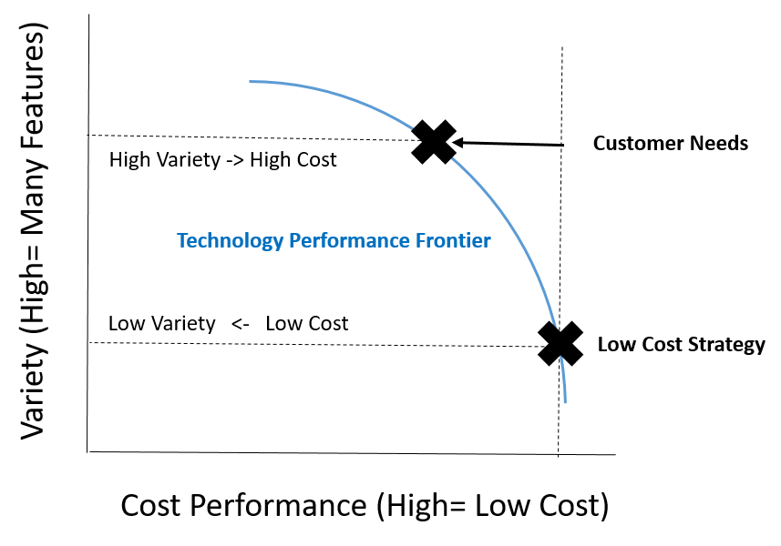
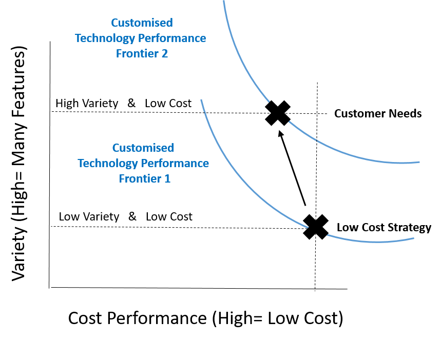

# (PART) Economic Theory {-}

# Mass Customisation {#MassCustomisation}

## Theoretical Concept

Mass Customisation is a powerful idea taught at leading business schools across the World. I was introduced to the concept over a coffee in Munich by a Graduate Student in Logistics from the Netherlands! It runs like this. A century ago, economies of scale in Manufacturing Processes brought down the price of mass-produced goods to the extent that customers were willing to trade-off their individual preferences for a cheap but standardized mass-produced good [@harvard]. Nowadays, new forms of organisation and technology are radically reducing this trade-off between individuality and cost [@lewis2002operations]. Thus enabling Mass Production of Customised Goods/Services, so called "Mass Customisation".

The key idea is to use customisable technology. This means each individual order is produced by technology customised to the customer's individual needs. In the traditional approach all orders for a given product are produced using the same technology. As we'll see below, this massively increases the influence of performance trade-offs and meeting the customer's needs becomes a compromise.

**Operations Strategy**

Mass Customisation is an extreme form of Operations Strategy. A holistic approach to running a business that has a particular meaning in business schools. Its key idea is that Businesses can improve performance by looking for markets where there is both a new product opportunity AND this product is something they can produce exceptionally well.

**Operations Strategy in Pictures**

Operations strategy is shown schematically in figure \@ref(fig:MassCustomisation1) below:

(ref:MassCustomisation1) Operations Strategy.

```{r MassCustomisation1,echo=FALSE, fig.cap='(ref:MassCustomisation1)'}

```

In the right-hand box you see the Market Requirements. These are summarised by Performance Objectives such as Quality, Speed, Flexibility, Dependability and Cost. Performance Objectives are influenced by which customer needs the product addresses and how they will attract these customers relative to the their competitors. 

The left hand box is called Operations Resources. These include the Assets of the firm (such as Software), the Processes of the firm (eg. ) and the Capabilities of the firm (eg. know-how of staff). 

In the centre is Operations Strategy. The process of reconciling the Resources available to the company with the Performance Objectives it has set. 

Mass Customisation is extreme because it treats each individual customer as a separate market whose orders are to be handled with a customised set of resources. Traditionally businesses consider the market for a whole product line and adjust their Operations Resources at this less granular level.

**Operations Strategy in Practice**

In practice, traditional Operations Strategy is much less granular than what Mass Customisation seeks to do. Porter summarised three distinct approaches: The Low Cost, Differentiation and Focus strategies. Each product is categorised into one of three buckets and the Operations Resources adjusted accordingly (see figure \@ref(fig:MassCustomisation2)).

(ref:MassCustomisation2) Porters Three Strategies

```{r MassCustomisation2,echo=FALSE, fig.cap='(ref:MassCustomisation2)'}

```


Whilst the company will produce its Low Cost products using different technology to its Differentiation products. Each order of the Low Cost product is produced using the same technology, irregardless of the customer need. 

** Order fulfillment in Practice**

In Mass Customisation, each order is produced using Customised Technology.The company has the abaility to quickly and cheaply customise production technology to an individual order. Traditionally this has not been the case. The company's technology is fixed by product line and changes are heavily constrained by time, cost, customer patience etc..

So if an important customer for a Low Cost Product desires a significantly higher quality, it can only be achieved at a large increase in cost (see figure \@ref(fig:MassCustomisation3)).

(ref:MassCustomisation3) Low Cost Strategy. To produce a higher variety of product features the business moves along the performance curve. This results in much higher costs.

```{r MassCustomisation3,echo=FALSE, fig.cap='(ref:MassCustomisation3)'}

```


In Mass Customisation, the idea is to fulfil the same order without a large change in cost (see figure \@ref(fig:MassCustomisation4)).

(ref:MassCustomisation4) To produce a higher variety of product features a customised technology is deployed. The business moves to a new performance curve. This costs do not increase significantly.


```{r MassCustomisation4,echo=FALSE, fig.cap='(ref:MassCustomisation4)'}

```


To quote: 

"As the concept of a mass market gained currency a century ago with the success of such giants as Sears, A&P, Coca-Cola, and Ford, all too many managers lost sight of a simple fact known for ages by every butcher, cobbler, and corner grocer: every customer is unique. Economies of scale in manufacturing and distribution brought down the price of mass-produced goods so much that all but the most well-to-do customers were often willing to forgo their individuality and settle for standardized—but very affordable—goods."

