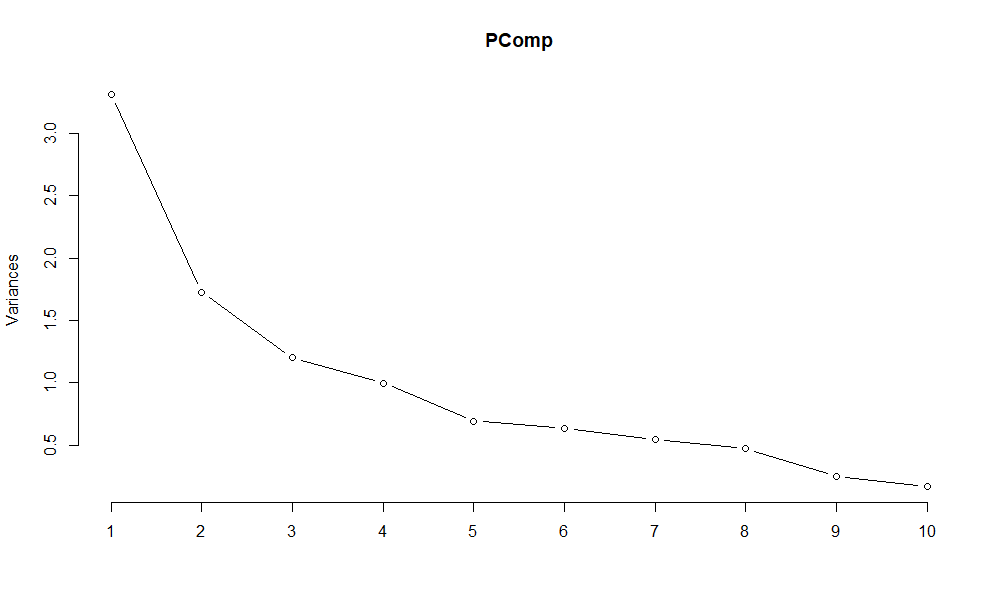
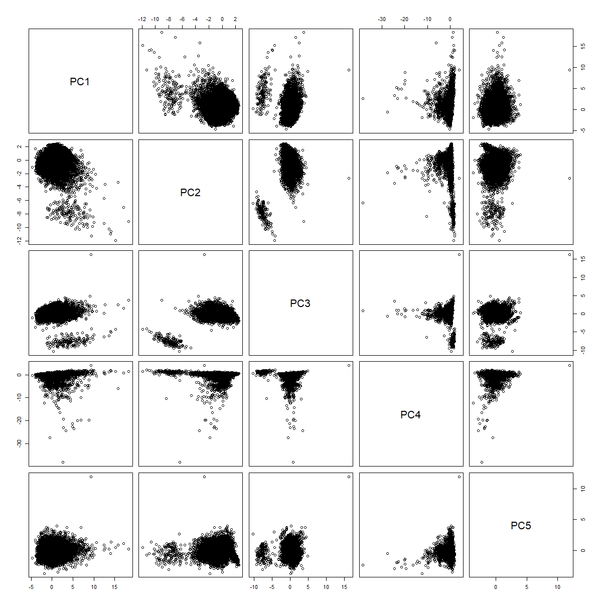
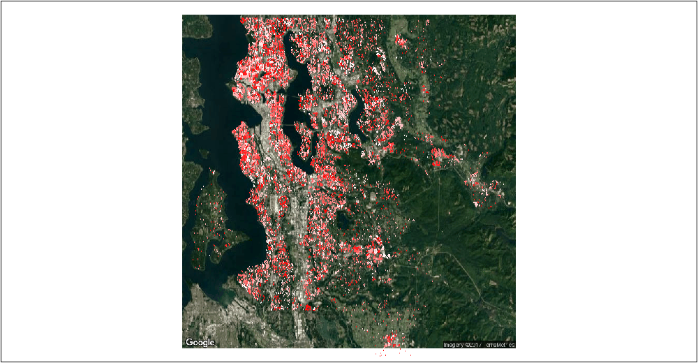
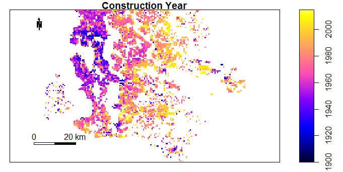
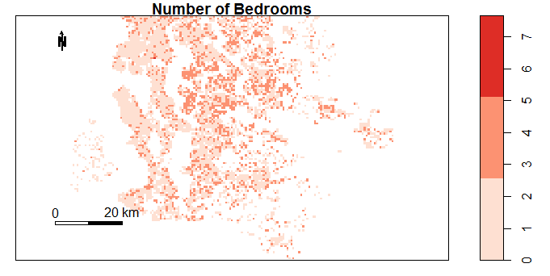
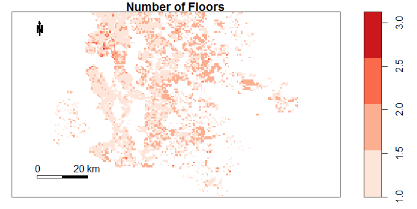

# (PART) Data {-}


# Original Data {#Data}

I am interested in applying multivariate analysis to understand the factors affecting property prices. To do this, I sourced  a property data-set from the website @kaggle1 which is discussed in the [Data Source](#OriginalData) section. The original data-set contained sale prices and property details for 21613 residential property sales between May 2014 and May 2015 in King County USA (includes Seattle). In the [Data Source](#OriginalData) section I use a range of plots to perform an in-depth exploratory analysis. Detecting Outliers and Errors is discussed in the [Outliers and Errors](#ErrorsOriginalData) Section. Multivariate techniques such as a Principal Component Decomposition and a Multivariate Clustering Technique are applied. The Original Data section closes with a novel use of [Factor Anaylsis](#FactorAnalysis) to explore hidden relationships in the data. 


## Data Source {#OriginalData}

The original data can be found on my GitHub site ([Source Data](ThesisPublished/Analysis/Data/kc_house_data.csv)). The data comprises a table with 21613 rows (one per property sale) and 19 columns of explanatory variables. Descriptions of each data column is shown below. The fields containing categorical data as opposed to numeric (discrete or continuous) are also identified. The absence of information for a particular property, in a particular field was encoded with a blank.

|Field Name   |  Data Type       | Data Description                                          |
|-------------|------------------|-----------------------------------------------------------|
|ID           |Continuous Numeric| Unique Property Identifier                                |
|Date         |Continuous Numeric| Date of Sale                                              |
|Price        |Continuous Numeric| Property Sale Price in USD                                |
|Bedrooms     |Dicrete Numeric   | Number of Bedrooms                                        |
|Bathrooms    |Dicrete Numeric   | Number of Bathrooms                                       |
|sqft_living  |Continuous Numeric| Size of the Living Space in square feet                   |
|sqft_lot     |Continuous Numeric| Total Size of the  property in square feet                         |
|floors       |Dicrete Numeric   | Number of Floors in Property                              |
|waterfront   |Categoric         | 1=Waterfront View, 0=No Waterfront View                   |
|view         |Categoric         | Number of Sides of Property with View
              |
|condition    |Categoric         | Property Condition (1=Poor Condition 5= Excellent Condition)|
|grade        |Categoric         | Property Condition (1=Poor, 13= Excellent)                 |
|sqft_above   |Continuous Numeric| Size of Upstairs Floors  in square feet                   |
|sqft_basement|Continuous Numeric| Size of Basement in square feet                           |
|yr_built     |Continuous Numeric| Construction Year                                         |
|yr_renovated |Continuous Numeric| Year Property Renovated                                   |
|zipcode      |Categoric         | Postal Code                                               |
|lat          |Continuous Numeric| Property Latitute                                         |
|long         |Continuous Numeric| Property Longitude                                        |

**Exploratory Analysis**

For large, multivariate data sets it takes more time to search through and explore a data set. The plots below allow a quick inspection of the original data-set. 

Whilst Visual inspection of the data table is tedious and unreliable, through sorting property ID's, I was able to identify that a small number of properties appear multiple times in the data. This comes about due to a single property being sold more than once during within the data collection period. For my analysis, I chose to retain only the most recent transactional record for properties with multiple appearances. This process reduced the size of the data-table from 21613 to 21436 rows.

In figure \@ref(fig:Outliers1), we that the largest 6% of all sale transactions by number, account for 18% of the total transactional value in the data. Furthermore, as can be seen  this group of properties outlies the other property values.

(ref:Outliers1) Revisiting the Data 1.

```{r Outliers1,echo=FALSE, fig.cap='(ref:Outliers1)',fig.align='center'}
knitr::include_graphics("Analysis/Images/Visualization1.png")
```

In figure \@ref(fig:DataExploration0), we see a large spread in the sizes of living spaces and a significant portion of properties without basements. In the lot size chart, we see again a large spread of sizes with a significant upper tail. 

(ref:DataExploration0) Revisiting the Data 2.

```{r DataExploration0,echo=FALSE, fig.cap='(ref:DataExploration0)',fig.align='center'}
knitr::include_graphics("Analysis/Images/Exploratory1.jpg")


```

In figure \@ref(fig:DataExploration2), we see that the modal number of bedrooms is three and the modal number of bathrooms is 2. There are 13 and 85 properties with no bedrooms or no bathrooms respectively. These are understood to be data entry errors are are excluded from the analysis data sets. There is also one mid-value property in the data with 33 bedrooms, this should also be excluded as an error. 

(ref:DataExploration2) Revisiting the Data 3.

```{r DataExploration2,echo=FALSE, fig.cap='(ref:DataExploration2)',fig.align='center'}

knitr::include_graphics("Analysis/Images/Exploratory2.jpg")


```


In figure \@ref(fig:DataExploration3), we see that the vast majority of the properties in the data-set do not have a waterfront view. This is surprising given the presence of significant lakes near to Seattle. We do see in figure \@ref(fig:DataExploration4), that a significant minority of properties do have a general view. It is possible that the low number of waterfront view properties is due to a very restrictive criteria set being applied (eg. property must be next to water for a waterfront view flag). The vast majority of the properties in the data are either single storey appartments or bungalows (10559) or two storey maisonettes (8209).

(ref:DataExploration3) Revisiting the Data 4.

```{r DataExploration3,echo=FALSE, fig.cap='(ref:DataExploration3)',fig.align='center'}

knitr::include_graphics("Analysis/Images/Exploratory4.jpg")


```

In figure \@ref(fig:DataExploration4), we see that a significant minority of the properties in the data-set (approx 10%) have a view on at least one side
There are only 193 properties in the data-set in poor condition (ie. condition less than 2). Visual inspection of these records, shows that they were built in the early 20th century and may have become dilapidated.

(ref:DataExploration4) Revisiting the Data 5.

```{r DataExploration4,echo=FALSE, fig.cap='(ref:DataExploration4)',fig.align='center'}

knitr::include_graphics("Analysis/Images/Exploratory5.jpg")


```

In figure \@ref(fig:DataExploration5), we see that the vast majority of properties were built in late 20th century and early 21st century. The earliest construction date in the data is 1900.The grade metric is another measure of property condition. As it has a wider range of values than "condition", it looks like a better differentiator of properties in good and bad states of repair.

(ref:DataExploration5) Revisiting the Data 6.

```{r DataExploration5,echo=FALSE, fig.cap='(ref:DataExploration5)',fig.align='center'}

knitr::include_graphics("Analysis/Images/Exploratory6.jpg")


```


## Outliers and Errors {#ErrorsOriginalData}

For large, multivariate data sets it is harder to search for individual outliers and errors. Visual inspection of the data table is tedious and unreliable. Through sorting the property ID's, I was able to identify that a small number of properties appears multiple times in the data. This comes about due to a single property being sold more than once during within the data collection period. For my analysis, I chose to retain only the most recent transactional record for properties with multiple appearances. This process reduced the size of the data-table from 21613 to 21436 rows.

Whilst the interdependencies between variables renders "one-at-a-time" approaches that focus on marginal distributions unreliable. Through plotting marginal distributions, I was able to identify that the largest 6% of all sale transactions by number, account for 18% of the total transactional value in the data. Furthermore, as can be seen in figure \@ref(fig:Outliers1), this group of properties outlies the other property values.


**Multivariate Analysis**

Powerful statistical techniques exist for detecting outliers in data generated by Multivariate normal distributions. Individual variables, when standardised, should follow the $t_{n-1}$ distribution. The generalised distance $(x_{j}-\overline{x})^´S^{-1}(x_{j}-\overline{x})$  of each vector of observations  $\underset{(p \times 1)}{x_{j}}$ from the sample mean $\overline{x}$ is approximately $\chi_{p-1}^2$ distributed. This means that, in addition to univariate and bivariate scatter plots, we can numerically identify outliers as points corresponding to very low or very high significance levels (see @johnson2014applied, Chapter 4, page 189).

By transforming the data first to standardised co-ordinates and then secondly to a principal component decomposition, I aimed to achieve approximate multivariate normality. I used the prcomp function in the stats package to obtain the principal components. The first five principal components account for 80% of the Sample Variation in the data. As a check I have plotted the eigenvalues of the Sample Covariance Matrix in fig \@ref(fig:OutliersPCA1) below. The steep slope in this Scree plot is consistent with the Variance in the data being captured in a few coordinates:

(ref:OutliersPCA1) The eigenvalues of the 10 eigenvectors of the Sample Covariance Matrix are plotted.

```{r OutliersPCA1,echo=FALSE, fig.cap='(ref:OutliersPCA1)',fig.align='center'}




```


Unfortunately, there are a large number of discrete variables in the data whose co-ordinates contribute significantly to the first 5 eigenvectors. As can be seen in the summary table below, number of bedrooms and condition are two of the biggest components in eigenvector 3. This means that the bivariate scatter plots in figure \@ref(fig:OutliersPCA3) do not resemble the smooth ellipses expected of Multivariate Normal Data.

(ref:OutliersPCA2) The components of the first 10 eigenvectors of the Sample Covariance matrix.

```{r OutliersPCA2,echo=FALSE, fig.cap='(ref:OutliersPCA2)',fig.align='center',warning=FALSE}

#Load Package
library(stats)
library(rcompanion)

#Obtain Data
Normal<-read.csv(file="Analysis/Data/kc_house_data.csv",sep=",",header = TRUE)

PCADataAll<-Normal[,c("price","bedrooms","bathrooms","sqft_living","sqft_lot","floors","waterfront","view","condition","yr_built")]

#Principal Components
PComp<-prcomp(PCADataAll,center=TRUE,scale=TRUE)

# Generate Predicted Data
PCADataAll2<-predict(PComp,PCADataAll)

#Calculate Generalised Distances

S<-cov(PCADataAll2)
Sinv<-solve(S)
d<-rep(0,times=21436)

for (i in c(1:21436)){
  d[i]<-crossprod(PCADataAll2[i,],crossprod(Sinv,PCADataAll2[i,]))
}

#Summary

PComp$rotation[,1:5]

```

(ref:OutliersPCA3) Bivariate plots of the PCA coordinate values. The distinct groups visible in all plots involving Principal Component 3 are due to discreteness in the data.

```{r OutliersPCA3,echo=FALSE, fig.cap='(ref:OutliersPCA3)',fig.align='center'}




```


If the multivariate normal assumption were appropriate and p=12, we would expect 5% of observations to have a generalised distance above 19.7. In fact in this data set 8% of observations lie above this. Nevertheless these were flagged as outliers.


**GeoSpatial Analysis**

I used the R package sp to plot the c.21000 individual properties onto a map and then to visualise how their properties vary spatially. This deepens our understanding of the data and the relationships within. 

The first 200 pages of [@bivand2008applied] are give a detailed practical guide to using the sp package. Objects of Spatial Class are enriched with a range of useful functions in sp. The plot in  figure \@ref(fig:Geo0) was created by merging my original data set with an image file from Google Maps. The transform function was used to transform both data sets to the same elliptical co-ordinate system (WGS 84) with the same centring parameters. My original data was then converted to a Spatial Points data frame. The Google Maps file was a Raster Image, essentially a grid of points, each with a latitude and longitude reference and a value for each Red, Green, Blue Colour levels. The image in \@ref(fig:Geo0) is a graph  created by layering the three data fields "Red", "Green", "Blue" plus my property locations according to a grid reference.

The data-set is plotted without aggregation in figure \@ref(fig:Geo0). This means I did not rasterise the spatial points data frame. The dark red points are high value properties and the white dots low value properties. The large dark blue region in the east of the photo is an inlet to the Pacific Ocean and the dark blue region in the centre of the plot is a lake.It is clear from the "green" colour of the relief in the eastern and central regions that these areas are less densely urbanised.

(ref:Geo0) Individual points plotted without aggregation


```{r Geo0,echo=FALSE, fig.cap='(ref:Geo0)',fig.align='center',dpi=60}

```


The ability within sp to aggregate data spatially enabled clearer visualisations. For the plots below I aggregated data into 200m by 200m blocks and averaged the results within these blocks. In figure \@ref(fig:Geo12), we see that the oldest properties are located in the north-west region and properties get progressively newer as we move east. This makes sense as areas nearer the Ocean would have had transportational advantages to initial residents. 

(ref:Geo12) Plot of Property Construction Year by Location

```{r Geo12,echo=FALSE, fig.cap='(ref:Geo4)',fig.align='center',dpi=60}

```

In Figure \@ref(fig:Geo14) we see that the average number of bedrooms follows roughly the same pattern as construction year. The average number of bedrooms per property tends to increase east to west, with very few old properties having more than 2 bedrooms. 

(ref:Geo14) Plot of Number of Bedrooms by Location

```{r Geo14,echo=FALSE, fig.cap='(ref:Geo4)',fig.align='center',dpi=60}

```

In Figure \@ref(fig:Geo13) we see that the average number of multi-storey properties does not seem to follow the same pattern as construction year. The higher number of multi-storey properties in the right-hand side of the plot corresponds with "green areas" in figure \@ref(fig:Geo0). We interpret therefore that there is more more space available for housing in these regions.

```{r Geo13,echo=FALSE, fig.cap='(ref:Geo4)',fig.align='center',dpi=60}

```

## Factor Analysis {#FactorAnalysis}
