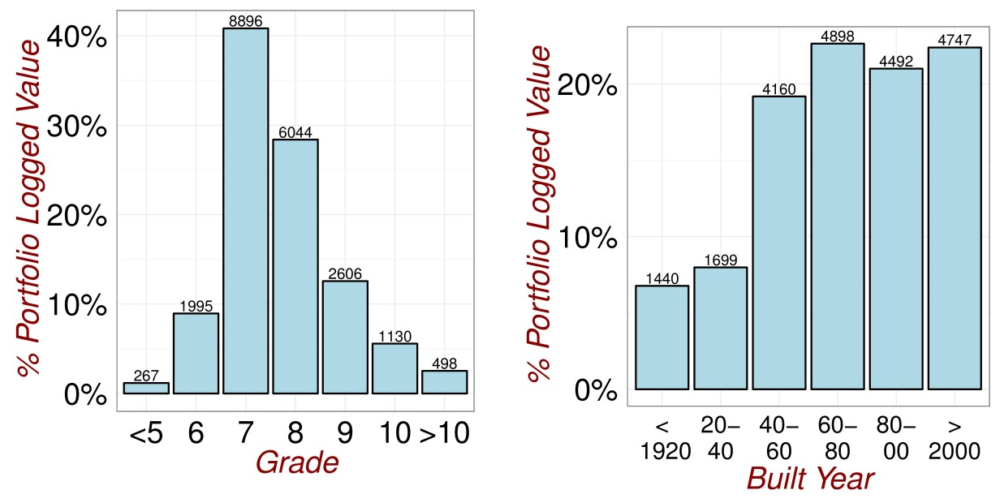

# (PART) Data {-}

# Data {#Data}

## Data Sources

I am interested in applying multivariate analysis to understand the factors affecting property prices. To do this, I sourced  a property data-set from the website @kaggle1 . The original data-set contained sale prices and property details for 21613 residential property sales between May 2014 and May 2015 in King County USA (includes Seattle).

To discover which variables, not included in the data-set, are known to influence property prices I conducted a literature search. This identified potential gaps and I performed significant data enrichment through writing custom R code to extract data from online data providers. For local area information, I identified the Google Maps and Google Radar Search API services. For financial information such as rental values, I identified the data services of the Seattle based real estate and rental marketplace [Zillow](https://www.zillow.com/corp/About.htm).  

**Original Data**

The original data can be found on my GitHub site ([Source Data](ThesisPublished/Analysis/Data/kc_house_data.csv)). The data comprises a table with 21613 rows (one per property sale) and 19 columns of explanatory variables. Descriptions of each data column is shown below. The fields containing categorical data as opposed to numeric (discrete or continuous) are also identified. The absence of information for a particular property, in a particular field was encoded with a blank.

|Field Name   |  Data Type       | Data Description                                          |
|-------------|------------------|-----------------------------------------------------------|
|ID           |Continuous Numeric| Unique Property Identifier                                |
|Date         |Continuous Numeric| Date of Sale                                              |
|Price        |Continuous Numeric| Property Sale Price in USD                                |
|Bedrooms     |Dicrete Numeric   | Number of Bedrooms                                        |
|Bathrooms    |Dicrete Numeric   | Number of Bathrooms                                       |
|sqft_living  |Continuous Numeric| Size of the Living Space in square feet                   |
|sqft_lot     |Continuous Numeric| Total Size of the  property in square feet                         |
|floors       |Dicrete Numeric   | Number of Floors in Property                              |
|waterfront   |Categoric         | 1=Waterfront View, 0=No Waterfront View                   |
|view         |Categoric         | Number of Sides of Property with View
              |
|condition    |Categoric         | Property Condition (1=Poor Condition 5= Excellent Condition)|
|grade        |Categoric         | Property Condition (1=Poor, 13= Excellent)                 |
|sqft_above   |Continuous Numeric| Size of Upstairs Floors  in square feet                   |
|sqft_basement|Continuous Numeric| Size of Basement in square feet                           |
|yr_built     |Continuous Numeric| Construction Year                                         |
|yr_renovated |Continuous Numeric| Year Property Renovated                                   |
|zipcode      |Categoric         | Postal Code                                               |
|lat          |Continuous Numeric| Property Latitute                                         |
|long         |Continuous Numeric| Property Longitude                                        |

**Exploratory Analysis**

For large, multivariate data sets it takes more time to search through and explore a data set. The plots below allow a quick inspection of the original data-set. 

Whilst Visual inspection of the data table is tedious and unreliable, through sorting property ID's, I was able to identify that a small number of properties appear multiple times in the data. This comes about due to a single property being sold more than once during within the data collection period. For my analysis, I chose to retain only the most recent transactional record for properties with multiple appearances. This process reduced the size of the data-table from 21613 to 21436 rows.

In figure \@ref(fig:Outliers1), we that the largest 6% of all sale transactions by number, account for 18% of the total transactional value in the data. Furthermore, as can be seen  this group of properties outlies the other property values.

(ref:Outliers1) Revisiting the Data 1.

```{r Outliers1,echo=FALSE, fig.cap='(ref:Outliers1)',fig.align='center'}
knitr::include_graphics("Analysis/Images/Visualization1.png")
```

In figure \@ref(fig:DataExploration0), we see a large spread in the sizes of living spaces and a significant portion of properties without basements. In the lot size chart, we see again a large spread of sizes with a significant upper tail. 

(ref:DataExploration0) Revisiting the Data 2.

```{r DataExploration0,echo=FALSE, fig.cap='(ref:DataExploration0)',fig.align='center'}
knitr::include_graphics("Analysis/Images/Exploratory1.jpg")


```

In figure \@ref(fig:DataExploration2), we see that the modal number of bedrooms is three and the modal number of bathrooms is 2. There are 13 and 85 properties with no bedrooms or no bathrooms respectively. These are understood to be data entry errors are are excluded from the analysis data sets. There is also one mid-value property in the data with 33 bedrooms, this should also be excluded as an error. 

(ref:DataExploration2) Revisiting the Data 3.

```{r DataExploration2,echo=FALSE, fig.cap='(ref:DataExploration2)',fig.align='center'}

knitr::include_graphics("Analysis/Images/Exploratory2.jpg")


```


In figure \@ref(fig:DataExploration3), we see that the vast majority of the properties in the data-set do not have a waterfront view. This is surprising given the presence of significant lakes near to Seattle. We do see in figure \@ref(fig:DataExploration4), that a significant minority of properties do have a general view. It is possible that the low number of waterfront view properties is due to a very restrictive criteria set being applied (eg. property must be next to water for a waterfront view flag). The vast majority of the properties in the data are either single storey appartments or bungalows (10559) or two storey maisonettes (8209).

(ref:DataExploration3) Revisiting the Data 4.

```{r DataExploration3,echo=FALSE, fig.cap='(ref:DataExploration3)',fig.align='center'}

knitr::include_graphics("Analysis/Images/Exploratory4.jpg")


```

In figure \@ref(fig:DataExploration4), we see that a significant minority of the properties in the data-set (approx 10%) have a view on at least one side
There are only 193 properties in the data-set in poor condition (ie. condition less than 2). Visual inspection of these records, shows that they were built in the early 20th century and may have become dilapidated.

(ref:DataExploration4) Revisiting the Data 5.

```{r DataExploration4,echo=FALSE, fig.cap='(ref:DataExploration4)',fig.align='center'}

knitr::include_graphics("Analysis/Images/Exploratory5.jpg")


```

In figure \@ref(fig:DataExploration5), we see that the vast majority of properties were built in late 20th century and early 21st century. The earliest construction date in the data is 1900.The grade metric is another measure of property condition. As it has a wider range of values than "condition", it looks like a better differentiator of properties in good and bad states of repair.

(ref:DataExploration5) Revisiting the Data 6.

```{r DataExploration5,echo=FALSE, fig.cap='(ref:DataExploration5)',fig.align='center'}




```


## Detecting Outliers and Errors

For large, multivariate data sets it is harder to search for individual outliers and errors. Visual inspection of the data table is tedious and unreliable. Through sorting the property ID's, I was able to identify that a small number of properties appears multiple times in the data. This comes about due to a single property being sold more than once during within the data collection period. For my analysis, I chose to retain only the most recent transactional record for properties with multiple appearances. This process reduced the size of the data-table from 21613 to 21436 rows.

Whilst the interdependencies between variables renders "one-at-a-time" approaches that focus on marginal distributions unreliable. Through plotting marginal distributions, I was able to identify that the largest 6% of all sale transactions by number, account for 18% of the total transactional value in the data. Furthermore, as can be seen in figure \@ref(fig:Outliers1), this group of properties outlies the other property values.


MULTIVARIATE ANALYSIS APPROACH

Powerful statistical techniques exist for detecting outliers in data generated by Multivariate normal distributions. Individual variables, when standardised, should follow the $t_{n-1}$ distribution. The generalised distance of each vector of observations $\underset{(p \times 1)}{x_{j}}$ from the sample mean $(x_{j}-\overline{x})^´S(x_{j}-\overline{x})$ is approximately $\chi_{p-1}^2$ distributed. This means that, in addition to univariate and bivariate scatter plots, we can numerically identify outliers as points corresponding to very low or very high significance levels (see @johnson2014applied, Chapter 4, page 189).

By transforming the data set to standardised co-ordinates and then to a principal component decomposition, I hope to recover new, "continuous" variables where the discreteness in the original data is not so prominent. Subsequently by performing power law transformations, I hope to obtain variables which are approximately, univariate normal random variables. This will then enable me to use the following procedure to identify outliers:

1. Calculate the standardized values $z_{jk}=\frac{(x_{jk}-\overline{x_{k}})}{\sqrt{s_{kk}}}$ for j=1,2,...,n and eachh column k=1,....,p in the data matrix. Examine these standardized values for very large or very small values.
2. Calculate the generalised squared distances $(x_{j}-\overline{x})^´S(x_{j}-\overline{x})$. Examine for unusually large values.

##Data Enrichment


**Literature Review Results**

The original data set only included information on the intrinsic characeteristics of a property. For example there were no variables pertaining to the neighbourhood of a property nor to macroeconomic conditions (eg. the state of the mortgage market, unemployment levels,National and local government policies, demographics etc).

Using only the original data could result in biased parameter estimates or the significance level of a variable being overstated. For example, the data comes from the period from May 2014 to May 2015 when the external environment in the US was relatively stable. This means that the level of noise in the data could be artificially low and the explanatory power of micro variables such as bedroom number overstated.

An online literature search helped to mitigate this risk and identified variables which previous research studies found to be significant predictors of property price. The table below shows the variables identified, the reference article and the matching field in the database. Article 1 is [@galati2011macro], Article 2 is [@candas2015], Website 1 is [@rightmove]

|Micro-variable         | Reference | Original Data-Set Field  |
|-----------------------|:---------:|--------------------------|
|Year of Construction   | Article 1 |Construction Year         |
|Size of Living Room    | Article 1 |Living Space              |
|Presence of Garage     | Article 1 |Missing                   |
|Presence of Garden     | Article 1 |Lot Size                  |
|Type of House          | Article 1 |Number of Floors          |
|Large City vs not large| Article 1 |Missing                   |
|Degree of Urbanization | Article 1 |Missing                   |
|Floor No               | Article 2 |Floors                    |
|Heating System         | Article 2 |Renovation Year           |
|Earthquake Zone        | Article 2 |Not relevant              |
|Rental Value           | Article 2 |Missing                   |
|Land Value             | Article 2 |Missing                   |
|Parcel Area            | Article 2 |Total Area                |
|Zoning                 | Article 2 |Zipcode                   |
|Proximity to Amenities | Website 1 |Missing                   |
|Number of Bedrooms     | Website 1 |Bedrooms                  |
|Number of Bathrooms    | Website 1 |Bathrooms                 |
|Condition of Interior  | Website 1 |Condition/Grade           |


**Data Enrichment**

The original data is missing a number of fields which the literature search flagged as important. In particular Proximity to Amenities, Rental Value, Large City vs not large. Some of these could simply be calculated from the original data. For example, since Seattle was the only large city in King County, "Large City vs Not Large" can be calculated using the zipcode data field and a list of Seattle zipcodes. 

Many of the missing data fields could not be calculated from the original data. Correspondingly I wrote custom R functions to retrieve additional fields from online data providers. Conducting significant volumes of "API calls" for free is a fiddly computational exercise. The code needs to handle error messages and parse results automatically. Furthemore, data providers typically place free usage limits of 1000 API calls per day and this needed to be circumvented to enrich my 21613 records!

The first step to using an API data-service is to obtain an Access Token from the data service. This can only be done manually by visiting the developer pages of the service's website and supplying user details (eg. email address). Access Tokens typically do not expire but do have usage limits of 1000 calls per day. By supplying Credit Card details to verify my identity I was able to increase my daily limit on Google to 50000 calls.

REVERSE GEOCODING

Each data-service requires a particular set of input information to be supplied to the server in a specified format. Unfortunately Zillow required the full property address as an input and this was not contained in the original data. Therefore before starting with data-enrichment I wrote the ReverseGeo function to reverse geocode my data (see end of page). Using this function, I looped through the 21613 records and by suppling latitute and longitude information, I obtained the full address details. To check that this process completed without error, I identified 10 properties randomly in the data and checked on google maps that the same building was identified using first lat/long information and then full address.

RADAR SEARCH

Having gotten the full address for each property, I used the Google Radar Search API to return places of interest near each property. Unfortunately to obtain the 10 data fields below, I had to loop through the entire data set over 10 times (once per data field). This exceeded my daily usage limit and I needed to create multiple access tokens to circumvent any access  Again, to check that this process completed without error, I identified 10 properties randomly in the data and checked on google maps that their neighbourhood contained the places of interest identified by the Radar API.


|Micro-variable                   | Source | Description                                            |
|---------------------------------|:------:|--------------------------------------------------------|
|Restaurants250m                  | Google |Number of Restaurants within 250m                       |
|Schools1000m                     | Google |Number of Schools within 1000m                          |
|PoliceStation1000m               | Google |Number of Police Stations within 1000m                  |
|SuperMarketGrocery750m           | Google |Number of Supermarkets or Grocery Stores within 750m    |
|Library750m                      | Google |Number of Libraries within 750m                         |
|LiquourStore250m                 | Google |Number of Liquour Stores within 250m                    |
|DoctorDentist250m                | Google |Number of Doctor or Dentists within 250m                |
|DepartmentStoreShoppingMall750m  | Google |Number of Department Stores or Shopping Malls with 750m |
|BusTrainTransitStation100m       | Google |Number of Bus or Transit Stations within 100m           |
|BarNightclubMovie500m            | Google |Number of Bars, Nightclubs or Movie Theatres within 500m|

ZILLOW SEARCH

Finally, I used the Zillow API to obtain information on the rental value of properties. The results from API calls to Zillow were in a hierarchical XML format and needed to be tidied significantly before they could be analysed. Occasionally the XML format of the result set changed and I needed to write the function in figure \@ref(fig:ZillowSearch) to automate result retrieval. Using this tidying function, I was able to add the following fields to each property in the data-set:

|Micro-variable                   | Source | Description                                            |
|---------------------------------|:------:|--------------------------------------------------------|
|RZEstimateAmount                 | Zillow |Monthly Rental Charge Estimatefor the Property          |


RESULTS 

The enriched data set is found [online](ThesisPublished/Analysis/Data/EnrichedData).

