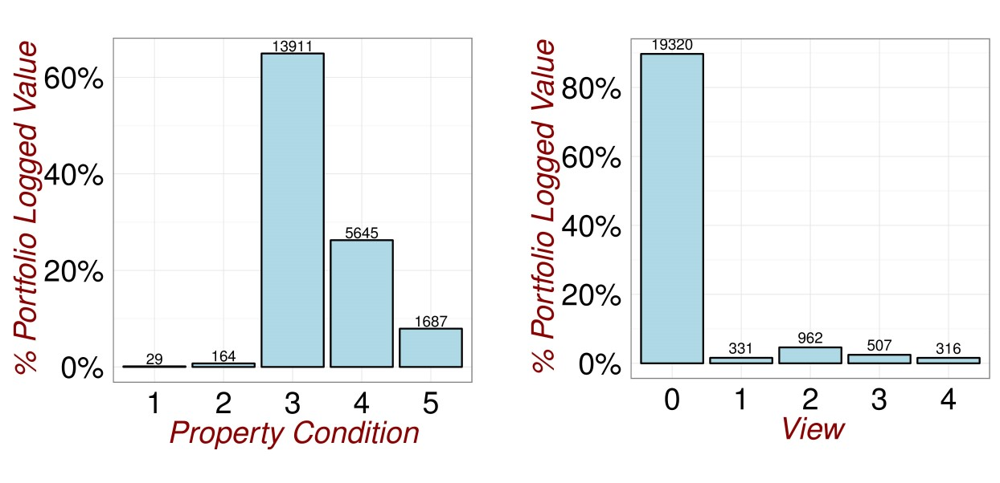

# (PART) Data {-}


# Original Data {#Data}

I am interested in applying multivariate analysis to understand the factors affecting property prices. To do this, I sourced  a property data-set from the website @kaggle1. The original data-set contains sale prices and property details for 21613 residential property transactions between May 2014 and May 2015 in King County USA (includes Seattle). 

In the [Data Source](#OriginalData) sub-section I discuss the Original Data set and conduct an in-depth exploratory analysis using a range of visualisations. Detecting Outliers and Errors is discussed in the [Outliers and Errors](#ErrorsOriginalData) sub-section. Multivariate techniques such as a **Principal Component Decomposition** and a **Multivariate Clustering Technique** are applied. The Original Data section closes with a novel use of **Factor Analysis** to investigate hidden relationships in the data. 


## Data Source {#OriginalData}

The original data can be found on my GitHub site ([Source Data](ThesisPublished/Analysis/Data/kc_house_data.csv)). The data comprises a table with 21613 rows (one per property sale) and 19 columns of explanatory variables. Descriptions of each data column is shown below. The fields containing categorical data as opposed to numeric (discrete or continuous) are also identified. The absence of information for a particular property, in a particular field was encoded with a blank.

|Field Name   |  Data Type       | Data Description                                          |
|-------------|------------------|-----------------------------------------------------------|
|ID           |Continuous Numeric| Unique Property Identifier                                |
|Date         |Continuous Numeric| Date of Sale                                              |
|Price        |Continuous Numeric| Property Sale Price in USD                                |
|Bedrooms     |Dicrete Numeric   | Number of Bedrooms                                        |
|Bathrooms    |Dicrete Numeric   | Number of Bathrooms                                       |
|sqft_living  |Continuous Numeric| Size of the Living Space in square feet                   |
|sqft_lot     |Continuous Numeric| Total Size of the  property in square feet                         |
|floors       |Dicrete Numeric   | Number of Floors in Property                              |
|waterfront   |Categoric         | 1=Waterfront View, 0=No Waterfront View                   |
|view         |Categoric         | Number of Sides of Property with View
              |
|condition    |Categoric         | Property Condition (1=Poor Condition 5= Excellent Condition)|
|grade        |Categoric         | Property Condition (1=Poor, 13= Excellent)                 |
|sqft_above   |Continuous Numeric| Size of Upstairs Floors  in square feet                   |
|sqft_basement|Continuous Numeric| Size of Basement in square feet                           |
|yr_built     |Continuous Numeric| Construction Year                                         |
|yr_renovated |Continuous Numeric| Year Property Renovated                                   |
|zipcode      |Categoric         | Postal Code                                               |
|lat          |Continuous Numeric| Property Latitute                                         |
|long         |Continuous Numeric| Property Longitude                                        |

**Exploratory Analysis**

For large, multivariate data sets it takes more time to search through and explore a data set. The plots below allow a quick inspection of the original data-set. 

Whilst Visual inspection of the data table is tedious and unreliable, through sorting property ID's, I was able to identify that a small number of properties appear multiple times in the data. This comes about due to a single property being sold more than once during within the data collection period. For my analysis, I chose to retain only the most recent transactional record for properties with multiple appearances. This process reduced the size of the data-table from 21613 to 21436 rows.

In figure \@ref(fig:Outliers1), we that the largest 6% of all sale transactions by number, account for 18% of the total transactional value in the data. Furthermore, as can be seen  this group of properties outlies the other property values.

(ref:Outliers1) Revisiting the Data 1.

```{r Outliers1,echo=FALSE, fig.cap='(ref:Outliers1)',fig.align='center'}
knitr::include_graphics("Analysis/Images/Visualization1.png")
```

In figure \@ref(fig:DataExploration0), we see a large spread in the sizes of living spaces and a significant portion of properties without basements. In the lot size chart, we see again a large spread of sizes with a significant upper tail. 

(ref:DataExploration0) Revisiting the Data 2.

```{r DataExploration0,echo=FALSE, fig.cap='(ref:DataExploration0)',fig.align='center'}
knitr::include_graphics("Analysis/Images/Exploratory1.jpg")


```

In figure \@ref(fig:DataExploration2), we see that the modal number of bedrooms is three and the modal number of bathrooms is 2. There are 13 and 85 properties with no bedrooms or no bathrooms respectively. These are understood to be data entry errors are are excluded from the analysis data sets. There is also one mid-value property in the data with 33 bedrooms, this should also be excluded as an error. 

(ref:DataExploration2) Revisiting the Data 3.

```{r DataExploration2,echo=FALSE, fig.cap='(ref:DataExploration2)',fig.align='center'}

knitr::include_graphics("Analysis/Images/Exploratory2.jpg")


```


In figure \@ref(fig:DataExploration3), we see that the vast majority of the properties in the data-set do not have a waterfront view. This is surprising given the presence of significant lakes near to Seattle. We do see in figure \@ref(fig:DataExploration4), that a significant minority of properties do have a general view. It is possible that the low number of waterfront view properties is due to a very restrictive criteria set being applied (eg. property must be next to water for a waterfront view flag). The vast majority of the properties in the data are either single storey appartments or bungalows (10559) or two storey maisonettes (8209).

(ref:DataExploration3) Revisiting the Data 4.

```{r DataExploration3,echo=FALSE, fig.cap='(ref:DataExploration3)',fig.align='center'}

knitr::include_graphics("Analysis/Images/Exploratory4.jpg")


```

In figure \@ref(fig:DataExploration4), we see that a significant minority of the properties in the data-set (approx 10%) have a view on at least one side
There are only 193 properties in the data-set in poor condition (ie. condition less than 2). Visual inspection of these records, shows that they were built in the early 20th century and may have become dilapidated.

(ref:DataExploration4) Revisiting the Data 5.

```{r DataExploration4,echo=FALSE, fig.cap='(ref:DataExploration4)',fig.align='center'}




```

In figure \@ref(fig:DataExploration5), we see that the vast majority of properties were built in late 20th century and early 21st century. The earliest construction date in the data is 1900.The grade metric is another measure of property condition. As it has a wider range of values than "condition", it looks like a better differentiator of properties in good and bad states of repair.

(ref:DataExploration5) Revisiting the Data 6.

```{r DataExploration5,echo=FALSE, fig.cap='(ref:DataExploration5)',fig.align='center'}

knitr::include_graphics("Analysis/Images/Exploratory6.jpg")


```


## Outliers and Errors {#ErrorsOriginalData}

For large, multivariate data sets it is harder to search for individual outliers and errors. Visual inspection of the data table is tedious and unreliable. Through sorting the property ID's, I was able to identify that a small number of properties appears multiple times in the data. This comes about due to a single property being sold more than once during within the data collection period. For my analysis, I chose to retain only the most recent transactional record for properties with multiple appearances. This process reduced the size of the data-table from 21613 to 21436 rows.

Whilst the interdependencies between variables renders "one-at-a-time" approaches that focus on marginal distributions unreliable. Through plotting marginal distributions, I was able to identify that the largest 6% of all sale transactions by number, account for 18% of the total transactional value in the data. Furthermore, as can be seen in figure \@ref(fig:Outliers1), this group of properties outlies the other property values.


**Multivariate Analysis**

Powerful statistical techniques exist for detecting outliers in data generated by Multivariate normal distributions. Individual variables, when standardised, should follow the $t_{n-1}$ distribution. The generalised distance $(x_{j}-\overline{x})^´S^{-1}(x_{j}-\overline{x})$  of each vector of observations  $\underset{(p \times 1)}{x_{j}}$ from the sample mean $\overline{x}$ is approximately $\chi_{p-1}^2$ distributed. This means that, in addition to univariate and bivariate scatter plots, we can numerically identify outliers as points corresponding to very low or very high significance levels (see @johnson2014applied, Chapter 4, page 189).

By transforming the data first to standardised co-ordinates and then secondly to a principal component decomposition, I aimed to achieve approximate multivariate normality. I used the prcomp function in the stats package to obtain the principal components. The first five principal components account for 80% of the Sample Variation in the data. As a check I have plotted the eigenvalues of the Sample Covariance Matrix in fig \@ref(fig:OutliersPCA1) below. The steep slope in this Scree plot is consistent with the Variance in the data being captured in a few coordinates:

(ref:OutliersPCA1) The eigenvalues of the 10 eigenvectors of the Sample Covariance Matrix are plotted.

```{r OutliersPCA1,echo=FALSE, fig.cap='(ref:OutliersPCA1)',fig.align='center'}


```


The co-ordinates of the first 5 eigenvectors are shown in the summary table below. The first principal component (PC1) has positive components for almost all variables and places most weight on the number of bathrooms, the size of the living space, the price and the number of bedrooms. I interpret this principal component as a Market Index, measuring the base-line value of a property. 

The second principal component (PC2) contrasts properties with scarce features in the data versus those with common features. High Property price, Condition, View or Waterfront are given large negative weight. Year Built and Floors have large positive weight. In this manner I interpret the second Principal Component as being a Scarcity/Uniqueness Index. 

(ref:OutliersPCA2) The components of the first 10 eigenvectors of the Sample Covariance matrix.

```{r OutliersPCA2,echo=FALSE, fig.cap='(ref:OutliersPCA2)',fig.align='center',warning=FALSE}

#Load Package
library(stats)
library(rcompanion)

#Obtain Data
Normal<-read.csv(file="Analysis/Data/kc_house_data.csv",sep=",",header = TRUE)

PCADataAll<-Normal[,c("price","bedrooms","bathrooms","sqft_living","sqft_lot","floors","waterfront","view","condition","yr_built")]

#Principal Components
PComp<-prcomp(PCADataAll,center=TRUE,scale=TRUE)

# Generate Predicted Data
PCADataAll2<-predict(PComp,PCADataAll)

#Calculate Generalised Distances

S<-cov(PCADataAll2)
Sinv<-solve(S)
d<-rep(0,times=21436)

for (i in c(1:21436)){
  d[i]<-crossprod(PCADataAll2[i,],crossprod(Sinv,PCADataAll2[i,]))
}

#Summary

PComp$rotation[,1:5]


```

The bivariate scatter plots of the first five principal components are shown in Figure \@ref(fig:OutliersPCA3). By inspection of the many scattered points towards the top of the first row of charts, it is clear many properties have unusually high values for PC1. This is consistent with the upper-tail of high priced properties in figure \@ref(fig:Outliers1) and I flagged all points with PC1 values above 10.5 as outliers.

In the second row of charts in Figure \@ref(fig:OutliersPCA3), there is a distinct cluster of points away from the main data cloud. This cluster of points is characterised by very low values for the Second Principal Component (PC2). I flagged all points with PC2 values below -6 as outliers, treating very high values for the "uniqueness" index similarly to very values for the "Market" Index PC1.


(ref:OutliersPCA3) Bivariate plots of the PCA coordinate values. The distinct groups visible in all plots involving Principal Component 3 are due to discreteness in the data.

```{r OutliersPCA3,echo=FALSE, fig.cap='(ref:OutliersPCA3)',fig.align='center'}

knitr::include_graphics("Analysis/Images/PCAPairs.png")


```


The procedure above removed 151 outliers points. Correspondingly, the bivariate scatter plots in figure \@ref(fig:OutliersPCA3) begin to resemble the smooth ellipses expected of Multivariate Normal Data. 


(ref:OutliersPCA4) Bivariate plots of the PCA coordinate values with outliers removed. 

```{r OutliersPCA4,echo=FALSE, fig.cap='(ref:OutliersPCA4)',fig.align='center'}


```


If the multivariate normal assumption were appropriate and p=10, we would expect 5% of observations to have a generalised distance above 16.92. In fact in this data set 16% of observations lie above this.

We begin to understand why this has occurred by applying a Clustering Algorithm. The scatter plots in Figure \@ref(fig:OutliersPCA5) were generated using using the mcclust package in R to fit a Mixture of Normal Distributions . The BIC criteria Value is significantly higher for a mixture of three (Equal Covariance) Multivariate Normal Distributions than for a single distribution.It is this heterogeneity in the data which makes the scatter plots in Figure \@ref(fig:OutliersPCA3) more disparate than otherwise.

Since according to Figure \@ref(fig:OutliersPCA5), outliers would still lie far from the centre of the data cloud, I used the 1% critical value of the $\chi_{9}^2$ distribution to flag the outermost data points as outliers. In this manner 563 additional data points (2.6% data) were flagged as outlying.

(ref:OutliersPCA5) Bivariate plots of Normal Mixture Model with three clusters each of equal Covariance.

```{r OutliersPCA5,echo=FALSE, fig.cap='(ref:OutliersPCA4)',fig.align='center'}


```


**GeoSpatial Checks**

To deepen my checking of the data and the relationships within, I used the R package sp to plot the c.21000 individual properties onto a map. The first 200 pages of [@bivand2008applied] give a detailed practical guide to using the sp package for further research. 

Sp can be used to create Spatial Class objects which are enriched with a range of useful functions. The plot in  figure \@ref(fig:Geo0) was created by layering my original property data set with an image file from Google Maps. The transform function was needed to align both data sets to the same elliptical co-ordinate system (WGS 84). The Google Maps file was actually a Raster Image, essentially a grid of points, each with a latitude and longitude reference and values for the level of Red, Green, Blue colours. I imported this as a Spatial Pixels Data-Frame. Using sp, I created the colourful image by layering the red, green and blue colour levels at each point. Finally I added the points representing each property. The dark red points are high value properties and the white dots low value properties.

The data-set is plotted without aggregation in figure \@ref(fig:Geo0). This means I did not rasterise the spatial points data frame.  

(ref:Geo0) Individual points plotted without aggregation.The large dark blue region in the east of the photo is an inlet to the Pacific Ocean and the dark blue region in the centre of the plot is a lake.It is clear from the "green" colour of the relief in the eastern and central regions that these areas are less densely urbanised.


```{r Geo0,echo=FALSE, fig.cap='(ref:Geo0)',fig.align='center',dpi=60}

```


The ability within sp to aggregate data spatially enabled clearer visualisations. For the plots below I aggregated data into 200m by 200m blocks and averaged the results within these blocks. In figure \@ref(fig:Geo12), we see that the oldest properties are located in the north-west region and properties get progressively newer as we move east. This makes sense as areas nearer the Ocean would have had transportational advantages to initial residents. 

(ref:Geo12) Plot of Property Construction Year by Location

```{r Geo12,echo=FALSE, fig.cap='(ref:Geo4)',fig.align='center',dpi=60}

```

In Figure \@ref(fig:Geo14) we see that the average number of bedrooms follows roughly the same pattern as construction year. The average number of bedrooms per property tends to increase east to west, with very few old properties having more than 2 bedrooms. 

(ref:Geo14) Plot of Number of Bedrooms by Location

```{r Geo14,echo=FALSE, fig.cap='(ref:Geo4)',fig.align='center',dpi=60}
knitr::include_graphics("Analysis/Images/GeoPlotBedrooms.png")
```

In Figure \@ref(fig:Geo13) we see that the average number of multi-storey properties does not seem to follow the same pattern as construction year. The higher number of multi-storey properties in the right-hand side of the plot corresponds with "green areas" in figure \@ref(fig:Geo0). We interpret therefore that there is more more space available for housing in these regions.

```{r Geo13,echo=FALSE, fig.cap='(ref:Geo4)',fig.align='center',dpi=60}
knitr::include_graphics("Analysis/Images/GeoPlotFloorNo.png")
```

## Profile Analysis {#Profile}

Having removed outliers, I want to check that the relationships in the data are consistent with common sense and that these relationships are statistically significant. For example, it is reasonable to expect that there are statistically significant differences between mean vectors when the data is segmented by price quartile. Since we are dealing with large sample sizes, such a test can be achieved with a One Way Multivariate Analysis of Variance Procedure (see [MANOVA](#MANOVA)).

**Testing for differences between Price Quartiles**

In Figure \@ref(fig:Outliers3), I segment the data according to (log) price quartile and plot the four mean co-ordinate vectors. (Each co-ordinate has been rescaled so that the units are similar.) It is clear that the profiles of the four quartiles are very similar. Comparing the Highest and Lowest Price Quartiles, we see there are more multi-floor properties with higher condition and with views in the Highest Quartile.

(ref:Visualisation1) Looking for Relationships.

```{r Outliers3,echo=FALSE, fig.cap='(ref:Visualisation1)',fig.align='center'}
knitr::include_graphics("Analysis/Images/Visualisation3.jpg")
```


**Hypothesis Testing**

The following strategy is recommended for Multivariate Comparisons of Treatments in  @johnson2014applied:

1.  Try to identify outliers
2.  Perform a multivariate test of hypothesis
3.  Calculate the Bonferroni simultaneous confidence intervals to identify components which differ significantly

The Null hypothesis is that $\tau_{1}=\tau_{2}=\tau_{3}=\tau_{4}=0$. Lets perform a two sided test at the five percent significance level. In the first set of results below, exlcuing outliers, we reject the Null at the 5% level using the Wilks Lambda statistics.

MULTIVARIATE TEST

(ref:MANOVA1) MANOVA Analysis including outliers.

```{r,echo=FALSE}

library(knitr)
library(xtable)

# Import data

data<-read.csv(file="Analysis/Data/HousePriceData.csv",header=TRUE,
               sep=",",stringsAsFactors = TRUE)

# Add Quantile Information
a<-cut(data$LogSalePrice, breaks=c(quantile(data$LogSalePrice, probs = seq(0, 1, by = 0.25))), 
       labels=c("0-25","25-50","50-75","75-100"), include.lowest=TRUE)

data$quantile<-a

#create data frame for the ANOVA

data2<-data[,c("AboveGroundFloor",
               "RenovationFlag",
               "grade",
               "condition",
               "View",
               "WaterfrontView",
               "NumberOfFloors",
               "NumberOfBedrooms",
               "NumberOfBathrooms",
               "SaleYear",
               "ConstructionYear",
               "TotalArea",
               "BasementSize",
               "LivingSpace",
               "quantile")]

data2$sqft_above<-data2$AboveGroundFloor
data2$sqft_living<-data2$LivingSpace
data2$sqft_lot<-data2$TotalArea


#Manova Test

fit.lm<-lm(cbind(sqft_above,
                   RenovationFlag,
                   grade,
                   condition,
                   View,
                   WaterfrontView,
                   NumberOfFloors,
                   NumberOfBedrooms,
                   NumberOfBathrooms,
                   SaleYear,
                   ConstructionYear,
                   sqft_lot,
                   sqft_living)
             ~quantile,data=data2)

fit.manova<-manova(fit.lm)

print(summary(fit.manova, test="Wilks"))

```


```{r,fig.cap='(ref:MANOVA1)',fig.align='center',echo=FALSE}

#Diagonal Elements of Residual Covariance Matrix

rownames(fit.manova$coefficients)<-c("Base","Base->Q2","Base->Q3","Base->Q4")


a<-diag(cov(fit.manova$residuals))*(0.5/21436)
a<-as.data.frame(a)
colnames(a)<-c("BF Range")

tab<-(cbind(round(t(fit.manova$coefficients),2),round(2*3.775285*a,2)))
kable(tab,type="html")

```

Following the recommendation in (@johnson2014applied), we also reject the Null if we include the outliers:

(ref:MANOVA2) MANOVA Analysis excluding outliers.

```{r,echo=FALSE}
# Import data

nooutlierdata<-read.csv(file="Analysis/Data/NoOutliers.csv",header=TRUE,
                 sep=",",stringsAsFactors = TRUE)

nooutlierdata$TransactionNo<-nooutlierdata$id

alldata<-read.csv(file="Analysis/Data/HousePriceData.csv",header=TRUE,
               sep=",",stringsAsFactors = TRUE)

alldata<-merge(alldata,nooutlierdata,by="TransactionNo")

# Add Quantile Information
a<-cut(alldata$LogSalePrice, breaks=c(quantile(alldata$LogSalePrice, probs = seq(0, 1, by = 0.25))), 
       labels=c("0-25","25-50","50-75","75-100"), include.lowest=TRUE)

alldata$quantile<-a

alldata$sqft_above<-alldata$AboveGroundFloor
alldata$sqft_living<-alldata$LivingSpace
alldata$sqft_lot<-alldata$TotalArea


#create data frame for the ANOVA

data3<-alldata[,c("sqft_above",
               "RenovationFlag",
               "grade.x",
               "condition.x",
               "View",
               "WaterfrontView",
               "NumberOfFloors",
               "NumberOfBedrooms",
               "NumberOfBathrooms",
               "SaleYear",
               "ConstructionYear",
               "sqft_lot",
               "BasementSize",
               "sqft_living",
               "quantile")]
#Manova Test

test<-manova(cbind(sqft_above,
                   RenovationFlag,
                   grade.x,
                   condition.x,
                   View,
                   WaterfrontView,
                   NumberOfFloors,
                   NumberOfBedrooms,
                   NumberOfBathrooms,
                   SaleYear,
                   ConstructionYear,
                   sqft_lot,
                   sqft_living)
             ~quantile,data=data3)

summary(test,test="Wilks")

```


```{r,fig.cap='(ref:MANOVA2)',echo=FALSE}

#Diagonal Elements of Residual Covariance Matrix

rownames(test$coefficients)<-c("Base","Base->Q2","Base->Q3","Base->Q4")


a<-diag(cov(test$residuals))*(0.5/21436)
a<-as.data.frame(a)
colnames(a)<-c("BF Range")

tab<-(cbind(round(t(test$coefficients),2),round(2*3.775285*a,2)))
kable(tab,type="html")

```

BONFERRONI INTERVALS


## Factor Analysis {#FactorAnalysis}
