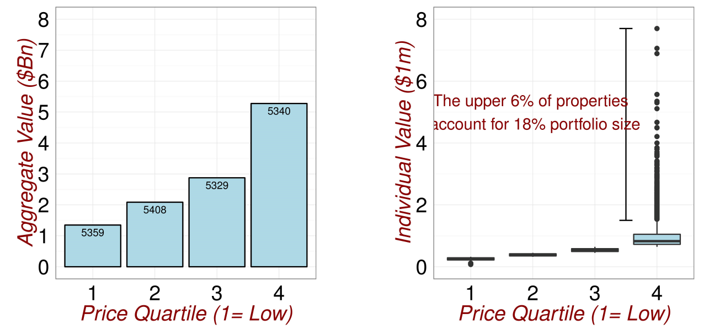
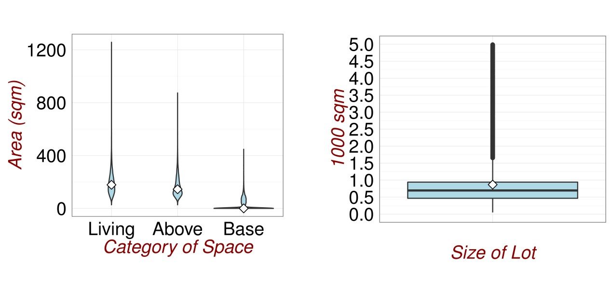
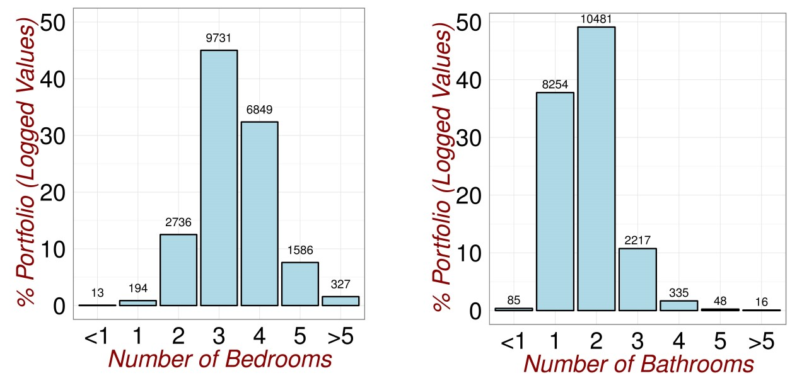
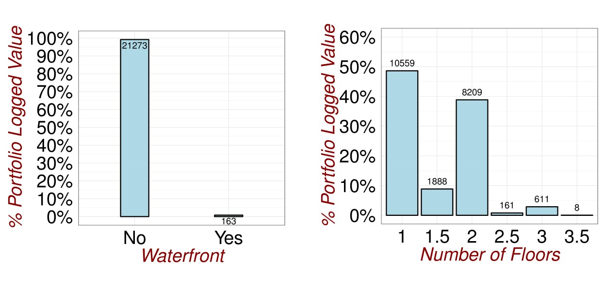
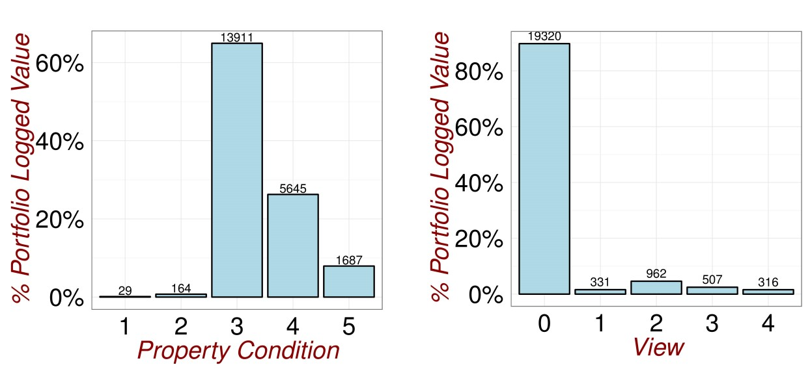
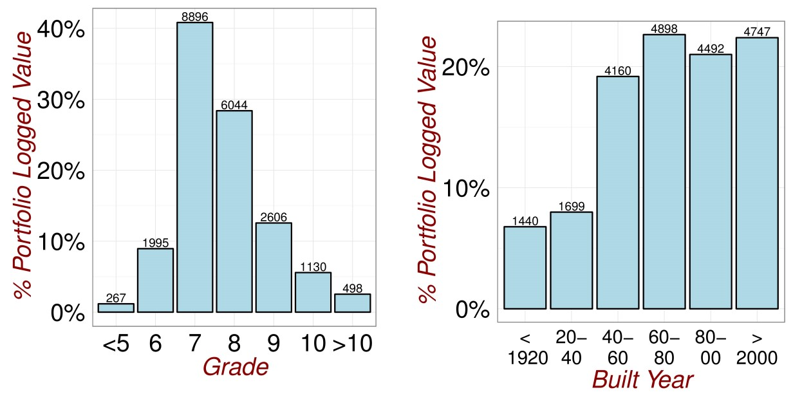
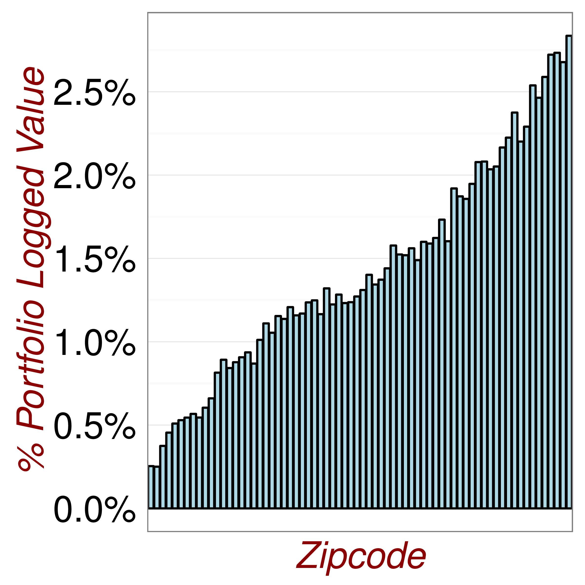

## Detecting Outliers and Errors

EXPLORATORY ANALYSIS 

For large, multivariate data sets it is harder to search for individual outliers and errors. Visual inspection of the data table is tedious and unreliable. Through sorting the property ID's, I was able to identify that a small number of properties appears multiple times in the data. This comes about due to a single property being sold more than once during within the data collection period. For my analysis, I chose to retain only the most recent transactional record for properties with multiple appearances. This process reduced the size of the data-table from 21613 to 21436 rows.

Whilst the interdependencies between variables renders "one-at-a-time" approaches that focus on marginal distributions unreliable. Through plotting marginal distributions, I was able to identify that the largest 6% of all sale transactions by number, account for 18% of the total transactional value in the data. Furthermore, as can be seen in figure \@ref(fig:Outliers1), this group of properties outlies the other property values.

(ref:Outliers1) Checking for Outliers.

```{r Outliers1,echo=FALSE, fig.cap='(ref:Outliers1)',fig.align='center'}

```

An initial inspection of the original data-set yields the visualisations in figures \@ref(fig:DataExploration1) and \@ref(fig:DataExploration2). As can be seen, for discrete numeric variables (eg. number of bedrooms, bathrooms etc), there are only small numbers of properties with very high values . These were checked by visual inspection in the data and were all associated with large property values and large living areas and hence are not considered to be outliers. For categorical variables it makes no sense to talk of outliers.

(ref:DataExploration1) Revisiting the Data.

```{r DataExploration1,echo=FALSE, fig.cap='(ref:DataExploration1)',fig.align='center'}











```

```{r DataExploration2,echo=FALSE, fig.cap='(ref:DataExploration1)',fig.align='center',out.width='40%'}

```


MULTIVARIATE ANALYSIS APPROACH

Powerful statistical techniques exist for detecting outliers in data generated by Multivariate normal distributions. Individual variables, when standardised, should follow the $t_{n-1}$ distribution. The generalised distance of each vector of observations $\underset{(p \times 1)}{x_{j}}$ from the sample mean $(x_{j}-\overline{x})^´S(x_{j}-\overline{x})$ is approximately $\chi_{p-1}^2$ distributed. This means that, in addition to univariate and bivariate scatter plots, we can numerically identify outliers as points corresponding to very low or very high significance levels (see @johnson2014applied, Chapter 4, page 189).

By transforming the data set to standardised co-ordinates and then to a principal component decomposition, I hope to recover new, "continuous" variables where the discreteness in the original data is not so prominent. Subsequently by performing power law transformations, I hope to obtain variables which are approximately, univariate normal random variables. This will then enable me to use the following procedure to identify outliers:

1. Calculate the standardized values $z_{jk}=\frac{(x_{jk}-\overline{x_{k}})}{\sqrt{s_{kk}}}$ for j=1,2,...,n and eachh column k=1,....,p in the data matrix. Examine these standardized values for very large or very small values.
2. Calculate the generalised squared distances $(x_{j}-\overline{x})^´S(x_{j}-\overline{x})$. Examine for unusually large values.


