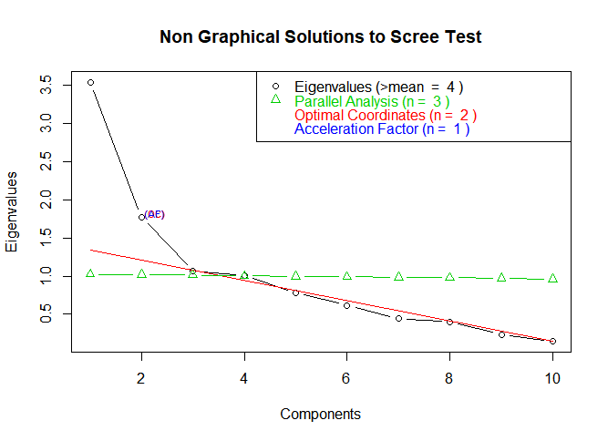
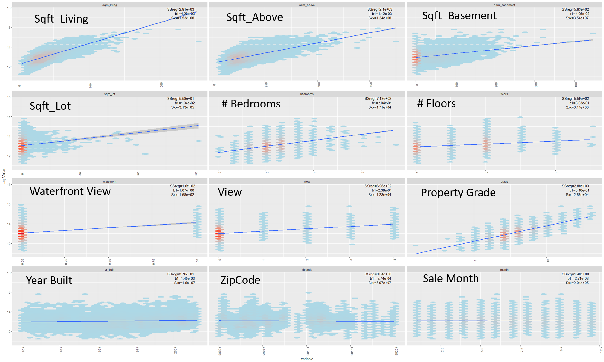
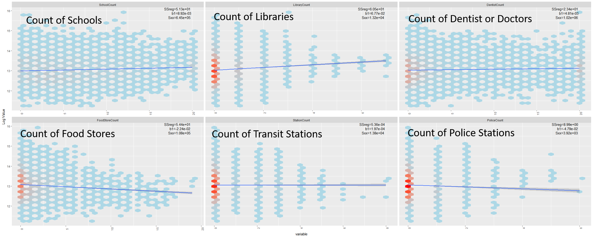

# (PART) Modelling {-}

# Profile Analysis {#Profile}

Are there statistically significant differences between properties in different price quartiles?

**Methodology**

Since we are dealing with large sample sizes, such a test can be achieved with a One Way Multivariate Analysis of Variance Procedure (see [MANOVA Section](#MANOVA) in the Introductory Theory Chapter).

Figure \@ref(fig:Outliers3) shows why it is important to perform this test. The data is segmented according to (log) price quartile and the four mean co-ordinate vectors are plotted. (Each co-ordinate has been rescaled so that the units are comparable.) It is clear that the profiles of the four quartiles are very similar. Comparing the Highest and Lowest Price Quartiles, we see there are more multi-floor properties with higher condition and with views in the Highest Quartile. Otherwise there appear to be few differences.

(ref:Visualisation1) Looking for Relationships.

```{r Outliers3,echo=FALSE, fig.cap='(ref:Visualisation1)',fig.align='center'}
knitr::include_graphics("Analysis/Images/Visualisation3.jpg")
```


The following MANOVA strategy is recommended for Multivariate Comparisons of Treatments in  @johnson2014applied:

1.  Try to identify outliers
2.  Perform a multivariate test of hypothesis
3.  Calculate the Bonferroni simultaneous confidence intervals to identify components which differ significantly

**Hypothesis Testing**

$H_{0}:\tau_{1}=\tau_{2}=\tau_{3}=\tau_{4}=0$. Lets perform a two sided test at the five percent significance level. 

The test results below show that, for the data set exlusing outliers, the 0.453 value for Wilks Lambda is significant at the 0.1% level and hence $H_{0}$ should be rejected. 

```{r MANOVA1,echo=FALSE}

library(knitr)
library(xtable)

# Import data

data<-read.csv(file="Analysis/Data/HousePriceData.csv",header=TRUE,
               sep=",",stringsAsFactors = TRUE)

# Add Quantile Information
a<-cut(data$LogSalePrice, breaks=c(quantile(data$LogSalePrice, probs = seq(0, 1, by = 0.25))), 
       labels=c("0-25","25-50","50-75","75-100"), include.lowest=TRUE)

data$quantile<-a

#create data frame for the ANOVA

data2<-data[,c("AboveGroundFloor",
               "RenovationFlag",
               "grade",
               "condition",
               "View",
               "WaterfrontView",
               "NumberOfFloors",
               "NumberOfBedrooms",
               "NumberOfBathrooms",
               "SaleYear",
               "ConstructionYear",
               "TotalArea",
               "BasementSize",
               "LivingSpace",
               "quantile")]

data2$sqft_above<-data2$AboveGroundFloor
data2$sqft_living<-data2$LivingSpace
data2$sqft_lot<-data2$TotalArea


#Manova Test

fit.lm<-lm(cbind(sqft_above,
                   RenovationFlag,
                   grade,
                   condition,
                   View,
                   WaterfrontView,
                   NumberOfFloors,
                   NumberOfBedrooms,
                   NumberOfBathrooms,
                   SaleYear,
                   ConstructionYear,
                   sqft_lot,
                   sqft_living)
             ~quantile,data=data2)

fit.manova<-manova(fit.lm)


print(summary(fit.manova, test="Wilks"))

```


Following the recommendation in (@johnson2014applied), we repeat the test using the data with outliers.Again the value for Wilks Lambda of 0.453 is significant at the 0.1% level and hence $H_{0}$ should be rejected.

```{r,echo=FALSE}
# Import data

nooutlierdata<-read.csv(file="Analysis/Data/NoOutliers.csv",header=TRUE,
                 sep=",",stringsAsFactors = TRUE)

nooutlierdata$TransactionNo<-nooutlierdata$id

alldata<-read.csv(file="Analysis/Data/HousePriceData.csv",header=TRUE,
               sep=",",stringsAsFactors = TRUE)

alldata<-merge(alldata,nooutlierdata,by="TransactionNo")

# Add Quantile Information
a<-cut(alldata$LogSalePrice, breaks=c(quantile(alldata$LogSalePrice, probs = seq(0, 1, by = 0.25))), 
       labels=c("0-25","25-50","50-75","75-100"), include.lowest=TRUE)

alldata$quantile<-a

alldata$sqft_above<-alldata$AboveGroundFloor
alldata$sqft_living<-alldata$LivingSpace
alldata$sqft_lot<-alldata$TotalArea


#create data frame for the ANOVA

data3<-alldata[,c("sqft_above",
               "RenovationFlag",
               "grade.x",
               "condition.x",
               "View",
               "WaterfrontView",
               "NumberOfFloors",
               "NumberOfBedrooms",
               "NumberOfBathrooms",
               "SaleYear",
               "ConstructionYear",
               "sqft_lot",
               "BasementSize",
               "sqft_living",
               "quantile")]
#Manova Test

test<-manova(cbind(sqft_above,
                   RenovationFlag,
                   grade.x,
                   condition.x,
                   View,
                   WaterfrontView,
                   NumberOfFloors,
                   NumberOfBedrooms,
                   NumberOfBathrooms,
                   SaleYear,
                   ConstructionYear,
                   sqft_lot,
                   sqft_living)
             ~quantile,data=data3)

summary(test,test="Wilks")

```

The Treatment effects and the width of the simultaneous Bonferroni confidence intervals ($\alpha=0.05$)are given below. Due to the c5000 observations in each quantile the confidence intervals are very narrow and even small differences in treatment effects are significant.

```{r Cor1,fig.align='center',echo=FALSE}

#Diagonal Elements of Residual Covariance Matrix

rownames(fit.manova$coefficients)<-c("Base","Base->Q2","Base->Q3","Base->Q4")


a<-diag(cov(fit.manova$residuals))*(0.5/21436)
a<-as.data.frame(a)
colnames(a)<-c("BF Range")

tab<-(cbind(round(t(fit.manova$coefficients),2),round(2*3.775285*a,2)))
kable(tab,type="html")

```

```{r MANOVA2,echo=FALSE, eval=FALSE}

#Diagonal Elements of Residual Covariance Matrix

rownames(test$coefficients)<-c("Base","Base->Q2","Base->Q3","Base->Q4")


a<-diag(cov(test$residuals))*(0.5/21436)
a<-as.data.frame(a)
colnames(a)<-c("BF Range")

tab<-(cbind(round(t(test$coefficients),2),round(2*3.775285*a,2)))
kable(tab,type="html")

```

**Conclusion**

We reject the Null at the 5% level, both with and without outliers, using the Wilks Lambda statistic. We conclude that there are statistically significant differences in the data between the mean vectors of the top, middle, lower and bottom price quartiles.

# Factor Analysis {#FactorAnalysis}

Is it possible to describe a Property data set with a few variables? Do these variables have sensible interpretations?

**Methodology**

I will use Orthogonal Factor Analysis, to investigate whether the original data is consistent with a lower dimensional description (see [Factor Analysis](#Factor) for theoretical introduction). 

Factor Analysis is designed to group variables with high pairwise correlations. In the data, Number of Bathrooms, Grade, Living Space, Number of Bedrooms and LogSalePrice all have large pairwise correlations (see below). It is therefore compelling to perform a Factor Anaysis:


```{r setup, include=FALSE}
library(psych)
library(nFactors)

library(dplyr)
library(xtable)
library(MASS)
library(texreg)

data2<-read.csv(file="Analysis/Data/HousePriceData.csv",header=TRUE,
               sep=",",stringsAsFactors = TRUE)


options("xtable.type"="html")

```

```{r setup2, echo=FALSE,warning=FALSE}
#Some data manipulation to convert factors to numeric
#Base R cannot calculate a correlation matrix with factor variables
data3<-data2

#Rename a Variable
data3<-rename(data3,
              AboveGroundFloorArea=AboveGroundFloor,
              Condition=condition,
              Grade=grade,
              LotSize=TotalArea)

#Reclassify a factor
data3$RenovationFlag<-as.numeric(levels(data2$RenovationFlag)=="Yes")[data2$RenovationFlag]
data3$SeattleFlag<-as.numeric(levels(data2$SeattleFlag)=="Yes")[data2$SeattleFlag]

#Subset the dataframe
data3<-subset(data3,select=c(ConstructionYear,
                      LivingSpace,
                      NumberOfFloors,
                      SeattleFlag,
                      RenovationYear,
                      LotSize,
                      NumberOfBedrooms,
                      NumberOfBathrooms,
                      Condition,
                      Grade,
                      AboveGroundFloorArea,
                      BasementSize,
                      SaleMonth,
                      View,
                      RenovationFlag,
                      WaterfrontView,
                      SaleYear,
                      LogSalePrice
                      ))

data4<-subset(data3,select=c(ConstructionYear,
                      LivingSpace,
                      NumberOfFloors,
                      SeattleFlag,
                      RenovationYear,
                      LotSize,
                      BasementSize,
                      NumberOfBedrooms,
                      NumberOfBathrooms,
                      Condition,
                      Grade,
                      LogSalePrice
                      ))

```


```{r Cor2, echo=FALSE, warning=FALSE}
mcor1<-round(cor(data4),digits=2)
col <- colorRampPalette(c("#BB4444", "#EE9988", "#FFFFFF", "#77AADD", "#4477AA"))
corrplot::corrplot(mcor1, 
         method="shade", 
         cl.cex=0.75,
         shade.col=NA, 
         type="lower",
         addCoef.col="black",
         tl.srt=45,
         addCoefasPercent = TRUE,
         number.cex=0.75
         )


```

It is important to note that there is no clearly defined procedure for measuring the quality of a Factor Analysis (see @johnson2014applied, Chapter 9, page 526 for further comments). Judging the success of a Factor Analysis depends on the subjective opinion of the investigator. Factor Anaylsis can have "Wow" factor by revealing insights that would otherwise be missed. 

**Model Fitting**

I applied a Principal Component Solution to the Orthogonal Factor Model using the psych and nFactors packages in R. Prior to applying the Factor Model, I standardised all the variables to have zero mean and unit variance. I estimated the Principal Components using a Singular Value Decomposition Method. As is convention when seeking to improve the interpretability of Principal Components, I performed an orthogonal Varimax rotation.

The scree plot in Figure \@ref(fig:Modelling1) indicated that five factors were an acceptable approximation to the data:

(ref:Modelling1) Number of Components in Factor Analysis

```{r Modelling1,echo=FALSE, fig.cap='(ref:Modelling1)',fig.align='center',dpi=60}

```

**Results**

The results of model fitting are shown below. The top block of results gives the co-ordinate representation of each of the five Orthogonal Factors (Column Headings RC1,..). The second block of results below gives the proportion of the total sample variance in the data explained by each Factor. The Factors have been ordered with decreasing eigenvalues. 

Overall using Five Factors it is possible to explain 80% of the variation in the 10 variables (cf. Cumulative Var). This represents a good fit. A linear relationship with 5 Common Factors is able to explain 80% of the variation in 10 Variables with the remaining 20% assumed to be noise. 

In the Orthogonal Factor Model (see \@ref(def:OrthFactor), the "h2"  column gives the %age of each variable's variance attributable to the five Common Factors. Number of Bedrooms is the only variate for which the first Five Factors only explains less than 70% of the variance. 

```{r FactorFit, echo=FALSE, warning=FALSE}

drops<-c("SeattleFlag","SaleMonth","RenovationFlag")
data4<-data4[,!(names(data4) %in% drops)]
fit <- principal(data4, nfactors=5, rotate="varimax")
fit
```

**Analysis**

The Orthogonal Factor Model and the multiple Mulivariate Regression Model can be interpreted similarly. For example, the components of a Factor represent the expected change in the response variable to a one unit change in the Factor.

RC1 could be interpretated as an Index of Property Value. A property is an investment and a pleace to live. A one unit increase of RC1, increases the price, property grade, size of living space, number of bathrooms, number of bedrooms significantly. RC2 relates to Internal Space Configuration. Properties with large values for RC2 have low numbers of floors and large Liveable or Basement Spaces. RC4 is an index of plot size. High values of RC5 are associated with modern buildings in poor condition. High values of RC3 with older properties, recently renovated.

**Conclusion**

I wanted to describe my Property data set using fewer variables. I fitted Orthogonal Factor Models with up to 10 Factors both with and without Varimax Rotations. I found that an orthogonal factor model with five Factors can account for 80% of the variation in the property data set.

Even in cases with more than five Factors, the components of the top Factors were similar to those described above. I do not feel that the five Factors are more easily understood the original variables and this is a key consideration in Factor Analysis. Given the lack of "Wow Factor", I do not proceed further with Factor Analysis.

# Correlation Analysis {#CanonAnalysis}

Does the enriched data-set contain new information or is there significant overlap with the original data?

**Methodology**

I will use Canonical Correlation Analysis to measure the degree of overlap between the two data sets (see [Canonical Correlation Analysis](#Canonical) for a theoretical introduction).

I expect significant overlap between the original and enriched data set. Variables in the original data set which do not represent geospatial information are indeed highly correlated with geospatial features. For exapmple in figure \@ref(fig:Geo12), I used the sp package to aggregate 21,436 properties in 200m by 200m grids and then to plot the average construction year by grid. We see that the oldest properties are located in the north-west region and properties get progressively newer as we move east. 

(ref:Geo12) Plot of Property Construction Year by Location

```{r Geo12,echo=FALSE, fig.cap='(ref:Geo4)',fig.align='center',dpi=60}
knitr::include_graphics("Analysis/Images/GeoPlotConstructionYr.png")
```

**Model Fitting**

I have modelled six Geospatial variables from the Enriched Data Set and 10 non-Geospatial variables from the Original Data set. The pair-wise correlations are shown below:

```{r SetupCanon, echo=FALSE, warning=FALSE,message=FALSE}
#Necessary Packages
library(CCA)
library(robustHD)

#Load the data

data3<-read.table(file="Analysis/Data/EnrichedData",header=TRUE,
               sep=",",stringsAsFactors = TRUE)

data2<-read.csv(file="Analysis/Data/HousePriceData.csv",header=TRUE,
                sep=",",stringsAsFactors = TRUE)

data2<-subset(data2,select=c(TransactionNo,grade,condition))

data3<-merge(data3,data2)


#Split into Original and Enriched Pieces

data3<-rename(data3,
              AboveGroundFloorArea=AboveGroundFloor,
              Condition=condition,
              Grade=grade,
              LotSize=TotalArea,
              SchoolCount=Schools1000m,
              DentistCount=DoctorDentist500m,
              LibraryCount=Library750m,
              FoodStoreCount=SupermarketGrocery750m,
              StationCount=BusTrainTransitStation100m,
              PoliceCount=PoliceStation1000m)

orig<-subset(data3,select=c(ConstructionYear,
                                   LivingSpace,
                                   NumberOfFloors,
                                   RenovationYear,
                                   LotSize,
                                   BasementSize,
                                   NumberOfBedrooms,
                                   NumberOfBathrooms,
                                   Condition,
                                   Grade
))


enr<-subset(data3,select=c(SchoolCount,
                           DentistCount,
                           LibraryCount,
                           FoodStoreCount,
                           StationCount,
                           PoliceCount))

a<-round(matcor(orig,enr)$XYcor,2)

corrplot::corrplot(a[1:10,11:16], 
                   method="shade", 
                   cl.cex=0.75,
                   shade.col=NA, 
                   type="lower",
                   addCoef.col="black",
                   tl.srt=45,
                   addCoefasPercent = TRUE,
                   number.cex=0.75
)


```

The correlations between the first six pairs of canonical variates are shown below. The Canonical Correlation between the first pair (v1, U1) is 57%, this is much higher than any entry in the correlation matrix above and shows the power of the canoncical co-ordinate transformation. There is clearly significant overlap between the information in each data-set.

```{r setupCanon2, echo=FALSE}


orig<-standardize(orig, centerFun = mean, scaleFun = sd)                           


enr<-standardize(enr, centerFun = mean, scaleFun = sd)                           


##Canonical Correlates

cc1<-cc(enr,orig)

table0<-as.data.frame(t(round(cc1$cor,2)))

table0<-rename(table0, Corr1=V1,Corr2=V2,Corr3=V3,Corr4=V4,Corr5=V5,Corr6=V6)

knitr::kable(
  table0,
  caption = 'Canonical Correlation Values'
)

```

**Analysis**

The correlation of each canonical variate with its respective data set is shown below. Variable V1 from the enriched data set is highly positively correlated with number of Schools, Dentists, Libraries and Food stores. V1 appears to measure Neighbourhood Services

U1 from the original data set is strongly negatively associated with Construction Year, Living Space, Lot Size, Number of Bedrooms.  U1 appears to measure older, smaller properties. 

The 57% correlation between V1 and U1 is likely explained by smaller, older properties being in highly urbanised areas near to lots of services. This can actually be visualised by comparing Figure \@ref(fig:Geo12) with the plots in the [Enrichment Results Section](#EnrichmentResults).


```{r resultsCanon, echo=FALSE}
#table1<-as.data.frame(round(cc1$xcoef,2))
#knitr::kable(
 # table1,
  #caption = 'Coefficient Values'
#)

table2<-as.data.frame(round(cc1$scores$corr.X.xscores,2))

knitr::kable(
  table2,
  caption = 'Correlation Values'
)

#table3<-as.data.frame(round(cc1$ycoef,2))
#table3<-rename(table3,U1=V1,
 #              U2=V2,
  #             U3=V3,
   #            U4=V4,
    #           U5=V5,
     #          U6=V6)

#knitr::kable(
 # table3,
  #caption = 'Coefficient Values'
#)

table4<-as.data.frame(round(cc1$scores$corr.Y.yscores,2))

table4<-rename(table4,U1=V1,
               U2=V2,
               U3=V3,
               U4=V4,
               U5=V5,
               U6=V6)

knitr::kable(
  table4,
  caption = 'Correlation Values'
)
```


**Conclusions**

There is significant overlap between the Original Data set and the Original Data set. The value for the first canonical correlation was 57%. Even though it does not appear possible at first glance, variables such as Construction Year have a geospatial pattern. It is these geospatial patterns which generate the large canonical correlation values with the enriched data set.

# Multivariate Regression Analysis {#MultiRegression}

How accurately can we model property prices using a linear model?

**Methodology**

I am going to use a multiple linear regression model to model house prices. Please see the [Linear Regression Section](#LinReg) for an introduction to the technique.

I expect a significant proportion of the variance in property values to be explained by a  Linear Model. This follows from the univariate plots in Figure \@ref(fig:LinearPlot1). Variables from the Original data set are plotted against Log Sale Price. Large $SS_{reg}$ values are observed for Sqft_living, sqft_basement,Sqft_Above, Grade andd Number of Bedrooms. Visually each of these covariates displays a wide range of values, with a line of best fit that dissects a long narrow data cloud.


(ref:LinearPlot1) Linear Relations in the Original Data Set.

```{r LinearPlot1,echo=FALSE, fig.cap='(ref:LinearPlot1)',fig.align='center'}


```

By contrast, I do not expect the variables from the Enriched Data Set to have significant explanatory power in a Multivariate Linear Regression Model. In Figure \@ref(fig:LinearPlot2), each of the plots displays significant scatter around the univariate lines of best fit and very small $SS_{reg}$ values are observed in comparison to Figure \@ref(fig:LinearPlot1).

(ref:LinearPlot2) Linear Relations in the Enriched Data Set.

```{r LinearPlot2,echo=FALSE, fig.cap='(ref:LinearPlot2)',fig.align='center'}

```

**Model Fitting**

To determine how accurately we can model property prices, I applied a step-wise Akaike fitting criterion from the MASS package. My starting model contained no covariates. I used the fully specified model, containing all variables in the data, to define an upper limit on the selection procedure. 

The Akaike Criterion has a scale parameter which is used increase the penalty term for models with a large number of parameters. I manually tuned the scale parameter to 20, as this seemed to balance selecting a model with 8-10 covariates to one with only one or two. I chose to perform forward and backwards model selection.


```{r, echo=FALSE,warning=FALSE,message=FALSE}
library(dplyr)
library(MASS)

data3<-read.table(file="Analysis/Data/EnrichedData",header=TRUE,
                  sep=",",stringsAsFactors = TRUE)

data2<-read.csv(file="Analysis/Data/NoOutliers.csv",header=TRUE,
                sep=",",stringsAsFactors = TRUE)

data2<-rename(data2,TransactionNo=id)

data2<-subset(data2,select=c(TransactionNo,grade,condition))

data3<-merge(data3,data2)


#Split into Original and Enriched Pieces

data3<-rename(data3,
              AboveGroundFloorArea=AboveGroundFloor,
              Condition=condition,
              Grade=grade,
              LotSize=TotalArea,
              SchoolCount=Schools1000m,
              DentistCount=DoctorDentist500m,
              LibraryCount=Library750m,
              FoodStoreCount=SupermarketGrocery750m,
              StationCount=BusTrainTransitStation100m,
              PoliceCount=PoliceStation1000m)

data4<-subset(data3,select=c(ConstructionYear,
                            LivingSpace,
                            NumberOfFloors,
                            RenovationYear,
                            LotSize,
                            BasementSize,
                            NumberOfBedrooms,
                            NumberOfBathrooms,
                            Condition,
                            Grade,
                            View,
                            WaterfrontView,
                            SchoolCount,
                            DentistCount,
                            LibraryCount,
                            FoodStoreCount,
                            StationCount,
                            PoliceCount,
                            LogSalePrice
))

library(MASS)


```


```{r, eval=FALSE}

library(MASS)

null<-lm(LogSalePrice ~
           1,data4)

full<-lm(LogSalePrice ~
           .,data4)

output<-step(null,scope=list(lower=null,upper=full),direction="both",scale=20)


```

The results below show the impact of changing the scale parameter in the step-wise fitting procedure. The Scale Parameters were 100, 20, 10, 2, and 0.1 respectively for Models 1, 2, 3, 4, 5. It is clear that reducing the penalty term leads to selecting models with more parameters. Whilst the extra parameters in these highly specified models do remain significant, they don't however lead to large increases in the $R^2$ value. 

The maximum $R^2$ value is in the region of 68%. 

```{r,echo=FALSE, warning=FALSE,error=FALSE, results='asis'}
library(xtable)
library(texreg)

fit1<-lm(LogSalePrice ~
        Grade+ConstructionYear+LivingSpace+SchoolCount,data4)

fit2<-lm(LogSalePrice ~
        Grade+ConstructionYear+LivingSpace+SchoolCount+View,data4)

fit3<-lm(LogSalePrice ~
        Grade+
          ConstructionYear+
          LivingSpace+
          SchoolCount+
          View+
          WaterfrontView+
          FoodStoreCount+
          LibraryCount,data4)


fit4<-lm(LogSalePrice ~
        Grade+
          ConstructionYear+
          LivingSpace+
          SchoolCount+
          View+
          WaterfrontView+
          FoodStoreCount+
          LibraryCount+
          Condition+
          NumberOfBathrooms+
          DentistCount,data4)

fit5<-lm(LogSalePrice ~
        Grade+
          ConstructionYear+
          LivingSpace+
          SchoolCount+
          View+
          WaterfrontView+
          FoodStoreCount+
          LibraryCount+
          Condition+
          NumberOfBathrooms+
          DentistCount+
          NumberOfBedrooms+
          PoliceCount+
          RenovationYear+
          LotSize+
          NumberOfFloors,data4)


a<-anova(fit1,fit5)

b<-data.frame(Model=c("Fit1","Fit5"),
              DoF=a$Res.Df,
              RSS=round(a$RSS,0),
              "DOF_Diff"=a$Df,
              SUmOfSq=a$`Sum of Sq`,
              FProb=round(a$`Pr(>F)`,2))

table2<-xtable(b,
               caption="Statistical Test Model 5 vs Model 1")


htmlreg(list(fit1,fit2,fit3,fit4,fit5),
       caption='Automated Model Selection',
       caption.above=TRUE)

```


```{r, echo=FALSE, eval=FALSE}

fit<-lm(LogSalePrice~
          Grade+
          ConstructionYear+
          LivingSpace+
          SchoolCount+
          View,data4)

summary(fit)

```

**Model Selection and Checking**

The plots below were generated for Model 4. Figure \@ref(fig:LinearPlot3), shows the residual errors of the Model versus a number of Covariates. The density plots do not show significant patterns and are consistent with what is expected from white noise. 
(ref:LinearPlot3) Residual Plots

```{r LinearPlot3,echo=FALSE, fig.cap='(ref:LinearPlot3)',fig.align='center'}
knitr::include_graphics("Analysis/Images/Plot25.jpg")
```

Figure \@ref(fig:LinearPlot4), gives quantile-quantile plots for the residuals of the model versus those of a normal distribution. The points closely fit a straight line, which is consistent with the model residuals being generated by a $N(0,\sigma^2)$ distribution.

(ref:LinearPlot4) QQPlots

```{r LinearPlot4,echo=FALSE, fig.cap='(ref:LinearPlot4)',fig.align='center'}
plot(fit4,which=2)
```


**Conclusion**

It is possible to fit a linear model to the Property Data Set and explain around 68% of the variation in (Logged) Property Prices. Furthermore such a model is compatible with the assumptions of a Multiple Linear Regression Model.

# (PART) Analytics Tool {-}

# Example Tool {#Tool}

Here is an example Analytics tool built with the Shiny Package in R.

```{r Model,echo=FALSE, eval=FALSE}
library(webshot)
library(knitr)

knitr::include_app("https://twoshotamericano.shinyapps.io/datavisual/", height="600px")

```


