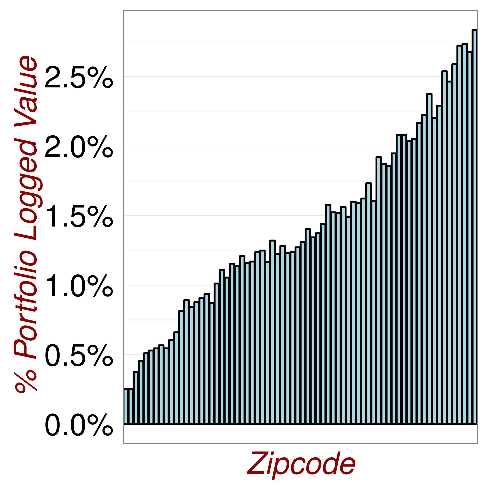

# Visualising Data {#Visualisations}

R is known for its ease of producing data visualisations. For quickly producing a range of plots, the ggplot2 package is awesome. See Appendix on [ggplot2](#ggplotrecap) for a refresher on this package.

In this Section, I present a range of visualisations to help understand our data and guide model fitting. In following this process I selected the model shown below. This new model is statistically significant and also an improvement on an old/traditional model fitting approach (see [Section 1.5](#TraditionalApproach))

```{r setup2, include=FALSE}
library(dplyr)
library(xtable)
library(MASS)
library(texreg)

#Read the datafile
data2<-read.table(file="Analysis/Data/HousePriceData.csv",header=TRUE,sep=",",stringsAsFactors = TRUE)

options("xtable.type"="html")

```

```{r ModelFitting,echo=FALSE}

#Some data manipulation to convert factors to numeric
data3<-data2

#Rename a Variable
data3<-rename(data3,
              AboveGroundFloorArea=AboveGroundFloor,
              Condition=condition,
              Grade=grade)

#Reclassify a factor
data3$RenovationFlag<-as.numeric(levels(data2$RenovationFlag)=="Yes")[data2$RenovationFlag]
data3$SeattleFlag<-as.numeric(levels(data2$SeattleFlag)=="Yes")[data2$SeattleFlag]

#Subset the dataframe
data3<-subset(data3,select=c(ConstructionYear,
                      LivingSpace,
                      NumberOfFloors,
                      SeattleFlag,
                      RenovationYear,
                      TotalArea,
                      NumberOfBedrooms,
                      NumberOfBathrooms,
                      Condition,
                      Grade,
                      AboveGroundFloorArea,
                      BasementSize,
                      SaleMonth,
                      View,
                      RenovationFlag,
                      WaterfrontView,
                      SaleYear,
                      LogSalePrice
                      ))

# Fit the Base Model (Model 1)

fit1<-lm(LogSalePrice ~
        ConstructionYear+
        LivingSpace+
        NumberOfFloors+
        SeattleFlag+
        RenovationYear+
        TotalArea+
        NumberOfBedrooms+
        NumberOfBathrooms+
        Condition+
        Grade,data=data3)

# Fit the Enhanced Model (Model 6)

data3$FlatFlag<-as.factor((data3$NumberOfFloors<2)*1)

fit2<-lm(LogSalePrice ~
        (ConstructionYear+
        LivingSpace+
        NumberOfFloors+
        SeattleFlag+
        RenovationYear+
        TotalArea+
        NumberOfBedrooms+
        NumberOfBathrooms+
        Condition+
        Grade)*FlatFlag,data=data3)


```

```{r, echo=FALSE}
formula(fit2)
```

```{r ModelChecking, echo=FALSE}
#Analysis of Variabe

a<-anova(fit1,fit2)

b<-data.frame(Model=c("Old","New"),
              DoF=a$Res.Df,
              RSS=round(a$RSS,0),
              "DOF_Diff"=a$Df,
              SUmOfSq=a$`Sum of Sq`,
              FProb=round(a$`Pr(>F)`,2))

table2<-xtable(b,
               caption="Statistical Test Old Model vs New Model")


```

```{r PrintTable, echo=FALSE,warning=FALSE, error=FALSE, results='asis'}
print.xtable(table2,caption.placement="bottom")

```

**Outliers**

We can use visualisations to help identify outliers. For example, in Figures \@ref(fig:Outliers1) we see that there exists a group of properties with very high values. We need to transform the reponse variable in order to achieve a satisfactory model fit. The results of a log transform are shown in  \@ref(fig:Outliers2).

(ref:Outliers1) Checking for Outliers.

```{r Outliers1,echo=FALSE, fig.cap='(ref:Outliers1)',fig.align='center'}
knitr::include_graphics("Analysis/Images/Visualization1.png")
```

(ref:Outliers1) Adjusting for Outliers.

```{r Outliers2,echo=FALSE, fig.cap='(ref:Outliers1)',fig.align='center'}

```

**Covariates**

Grids of plots are useful for understanding the different segments of the portfolio. For example in \@ref(fig:Outliers3), we examine the 21000 properties by (log) price quartile.The lowest price quartile has very low floor number which may indicate more appartments than condominiums. The highest price quartile has more properties with a View. This may indicate they are in superior locations.

(ref:Visualisation1) Looking for Relationships.

```{r Outliers3,echo=FALSE, fig.cap='(ref:Visualisation1)',fig.align='center'}
knitr::include_graphics("Analysis/Images/Visualisation3.jpg")
```

**Visualisations**

It is so easy to create plots in R that you can go wild. In figures \@ref(fig:DataExploration1) and \@ref(fig:DataExploration2), I do exactly this.

(ref:DataExploration1) Revisiting the Data.

```{r DataExploration1,echo=FALSE, fig.cap='(ref:DataExploration1)',fig.align='center'}
knitr::include_graphics("Analysis/Images/Exploratory1.jpg")

knitr::include_graphics("Analysis/Images/Exploratory2.jpg")

knitr::include_graphics("Analysis/Images/Exploratory3.jpg")

knitr::include_graphics("Analysis/Images/Exploratory4.jpg")

knitr::include_graphics("Analysis/Images/Exploratory5.jpg")

knitr::include_graphics("Analysis/Images/Exploratory6.jpg")

```

```{r DataExploration2,echo=FALSE, fig.cap='(ref:DataExploration1)',fig.align='center',out.width='40%'}

```

**Statistics**

Before fitting multivariate models it is important to understand the direction of univariate relationships between explanatory variable and response.

(ref:ModelFit2) Understanding Relationships.

```{r ModelFit2,echo=FALSE, fig.cap='(ref:ModelFit2)',fig.align='center'}
knitr::include_graphics("Analysis/Images/Plot19.jpg")
```


(ref:Interactions) Improving the model

Here in Figure \@ref(fig:ModelFit1) are the residual plots from my new model.

(ref:ModelFit1) Looking for Poor Model Fit.

```{r ModelFit1,echo=FALSE, fig.cap='(ref:ModelFit1)',fig.align='center'}
knitr::include_graphics("Analysis/Images/Plot25.jpg")
```

