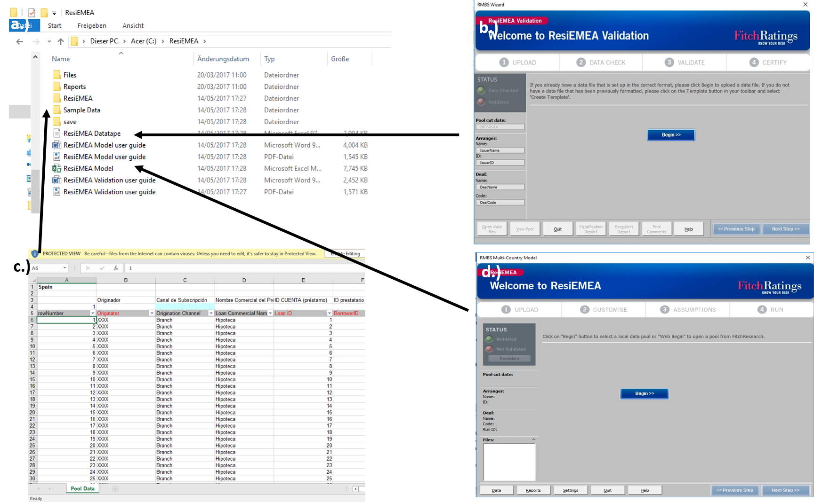
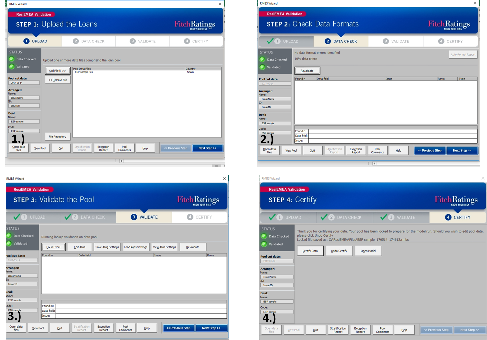
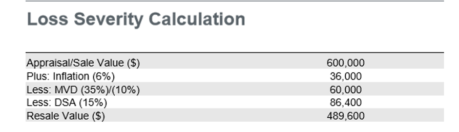
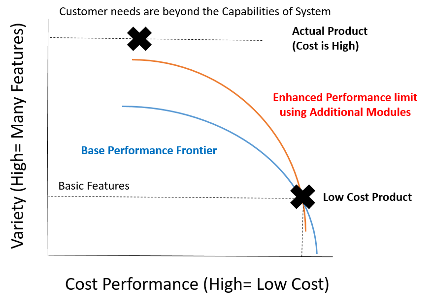
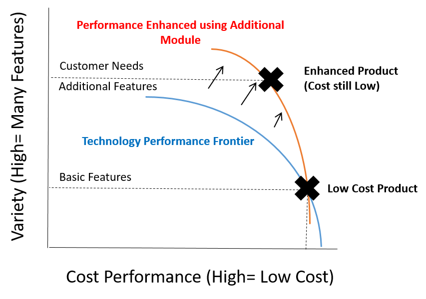

# (PART) Closing Remarks {-}

# Conclusion {#Conclusions}

This thesis is about Data Analytics in Business. A key challenge being to empower colleagues to engage with Data Analytics themselves (and not leave it to the nerds in the corner)! 

I have presented R Studio as a next generation Analytics tool. In Section 1, we worked through an example of how R Studio allows you to do so much more!! You saw an interactive Shiny model and some advanced visualisations. In Section 2, we looked in more detail at the R Studio system and the economic rationale for embracing it.

To end where we started: **How** can we empower our colleagues to embrace Data Analytics? **How** can we enable our colleagues to solve their own Data Problems? **Why** is this an economically sensible approach? 

*Use the R Studio system as the enabling technology because it allows Mass Customisation, 3D printing for Data Projects*

# Appendices

## Motivating Example {#MicrosoftProblems}

A key hypothesis of this thesis is that we need R Studio to unlock "Mass Customisation" in Business Analytics.In this section I want to show that there is no way you are going to achieve Mass Customisation with Microsoft Software. 

Microsoft uses a modular system for its Business Software, relying on high quality interfaces to ensure interoperability. Whilst not every Microsoft analytics tool looks like what follows. I am putting this tool under the spotlight as a "best in class" Microsoft product. Why? Well, if you imagine a financial services company making a huge amount of cash and employing over 2000 analysts, then its models should be be pretty high quality. Right?

**Background to the Case Study**

So the Case Study I want to guide you through goes something like this. A mortgage is a very large loan made by a lending business to individuals purchasing a home. The mortgage typically represents 3-5 times the salary of the borrower and can take up to 50 years to repay! Investors in mortgage lending businesses are clearly motivated to make sure these repayments happen. To this end, they can obtain a financial health check from a Rating Agency. What has this got to do with Microsoft Analytics tools?

One of the "Big Three Credit Ratings Agencies" a company called Fitch Ratings Inc developed a health check tool [@FitchModel]. They wanted to provide a free-to-download tool that runs on the Microsoft Excel desktop-package. Their objective was to make the tool perform the complex calculations so that the user can focus on their investment questions: can the customer afford to repay his loan and what is the resale value of the property. 

**Description of the Tool**

On its website Fitch describes its tool as [@FitchModel2],[@FitchModel3]:

-    The tool provides "An Analytical model that helps with the risk assessment of Residential Mortgage loans". 
-    The "sustainable home price model" is used to determine the true value of a property. A sustainable long-term house price is calculated based on six key drivers identified through regression analysis on a data-set from 1976-2011 .
-    The "Probability of Default model" uses a regression-based analysis to estimate the probability that a customer stops making payments. There are 13 independent variables in the model, 11 individual loan and borrower attributes and one related to economic risk factors. The model is based on data from 1991-2009.

When you click download, you'll get a zip file containing how-to documentation and two Microsoft Excel files containing the tool (see figure \@ref(fig:ResiEMEA1)). 

(ref:ResiEMEA1) A screenshot of what the downloaded .zip file contains. Figure a.) Shows the individual files including user guides but also two excel tools. b.) The Datatape tool c.) The data template and d.) The Model tool

```{r ResiEMEA1,echo=FALSE, fig.cap='(ref:ResiEMEA1)'}

```

**How the tools works**

Whilst the download does contain easy to read documentation, the tool guides the user through the analysis in a self-explanatory way using a pop-up "wizard" application.

As with all calculation engines, Fitch's tool requires data in a specific format. If you look at the figures xx xx, you will see a number of data validation and certification steps. This is actually the reason why a pop-up wizard was required (see figure \@ref(fig:ResiEMEA2)). 

(ref:ResiEMEA2) Screenshots of the wizard guiding the user through four data validation steps

```{r ResiEMEA2,echo=FALSE, fig.cap='(ref:ResiEMEA2)'}

```

I mentioned above that there are two key models in the tool. The "sustainable home price model" calculates property resale values. In figure \@ref(fig:ResiEMEA3) you'll see an example calculation:

(ref:ResiEMEA3) Screenshot of the resale value calculation

```{r ResiEMEA3,echo=FALSE, fig.cap='(ref:ResiEMEA3)'}

```

This is clearly not a "regression model" using six factors. It is an accounting based calculation with just three adjustments! What has gone wrong!?

**Observations**

The critical flaw in this tool is the need to include a "wizard". Unfortunately there is no inbuilt, customisable "wizard" within any Microsoft products to guide users through a process. 

To create one, an enhancement must be built by software developers. For sure the professional looking and robust tool is a credit to the quality of the software team. However this must have been an expensive and slow process! In the mix it looks like the the calculation engine became highly simplified and may no longer meet the needs of the tool's users. 

In pictures (see figure \@ref(fig:Microsoft2)), we have the needs of the customer falling beyond the capabilities of the modular system. Consequently as with traditional Operations Strategy, significant cost is involved to customise the production of the tool. This is not Mass Customisation at work!!

(ref:Microsoft2) Trade-off diagram for this tool

```{r Microsoft2,echo=FALSE, fig.cap='(ref:ResiEMEA3)'}

```
**A Theoretical Look at the Microsoft Product Suite**

Microsoft has organised its Business Software using a modular strategy. Each unit (or module) of software performs a distinct function and is designed to operate both independently but also in an integrated whole if needed. This is achieved through providing high quality interfaces between modules, enabling easy connection and communication.

Microsoft's product strategy is not the same for each software module. On the one side, Microsoft offers its Office Products (eg. Excel, Word, Powerpoint, Access) using a Low Cost strategy to ensure mass market appeal and affordability. On the other side, Microsoft offers a suite of Advanced Analytics Products (eg. SQL Management Studio, Analysis Services, Reporting Services...) using a Differentiation Strategy to deliver enhanced features but at significant additional cost to the user.

So if a customer needs an Excel based tool with functionality to analyse data in an online transactional database, both Low Cost and High Cost modules must be purchased. If we analyse this approach using the trade-off curves of the previous section it is obviously not mass customisation (see figure \@ref(fig:Microsoft1)):

(ref:Microsoft1) Performance trade-offs using Microsoft

```{r Microsoft1,echo=FALSE, fig.cap='(ref:Microsoft1)'}

```

In words, the Microsoft modular approach meets enhanced customer requirements by moving from one generic performance frontier to another. There is no customised performance frontier for the new product and there is no customisation to the production process. This is not Mass Customisation.

**A Practical Case Study of Microsoft Analytics in Action**

