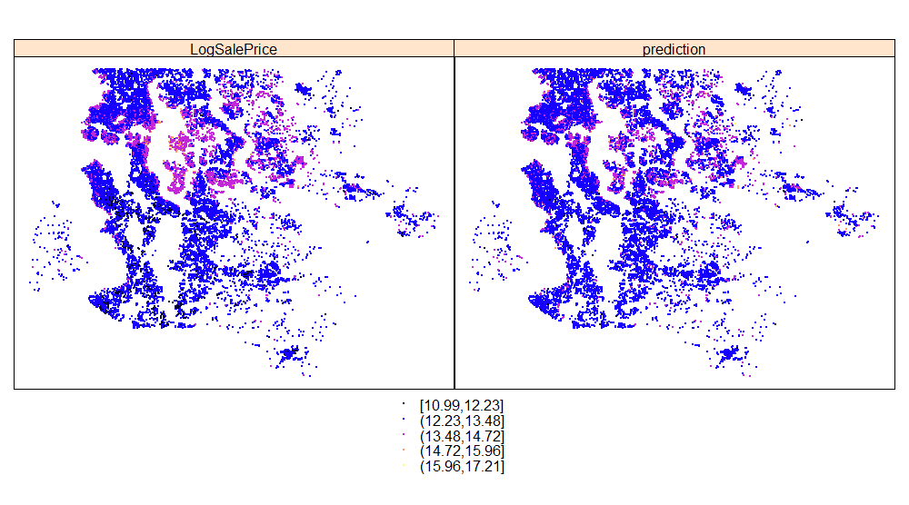

# Geo Analysis {#GeoAnalysis}

```{r GeoAnalysisPrelim, include=FALSE}
library(dplyr)
library(xtable)
library(MASS)
library(texreg)
library(sp)
library(RColorBrewer)

#Read data file with geo data
data6<-read.table(file="Analysis/Data/EnrichedData",header=TRUE,
                  sep=",",stringsAsFactors = TRUE)

#Get the Condition and Grade variables
origdata<-read.csv(file="Analysis/Data/HousePriceData.csv",header=TRUE,
                     sep=",",stringsAsFactors = TRUE)

origdata<-origdata[,c("TransactionNo","condition","grade")]

data6<-merge(data6,origdata,by.x="TransactionNo",by.y="TransactionNo")

#data6$condition<-origdata$condition[data6$TransactionNo]

#Create a Spatial Points Data-frame
coordinates(data6)<-c("Long","Lat")

#Remove data-points assumed to be errors
errors<-which(coordinates(data6)[,1]> -121.7 |
        coordinates(data6)[,1]< -122.6)
data6<-data6[-errors,]

#Generate the Predictions from Fitted Model
data6$FlatFlag<-as.factor((data6$NumberOfFloors<2)*1)
data7<-slot(data6,"data")

#FIt a Linear Model
fitg1<-lm(LogSalePrice ~
           condition+
           grade+
           SeattleFlag+
           RenovationYear+
           TotalArea+
           NumberOfBedrooms+
           NumberOfBathrooms+
         LivingSpace+
           NumberOfBedrooms+
            #NumberOfFloors+
            ConstructionYear+
            WaterfrontView+
            SeattleFlag+
            #Restaurants250m+
            Schools1000m+
            PoliceStation1000m+
            SupermarketGrocery750m+
            #Library750m+
            #LiquorStore250m+
            DoctorDentist500m+
            #DepartmentStoreShoppingMall750m+
            #BusTrainTransitStation100m+
            BarNightclubMovie500m+
            #RZestimateHighValueRange+
            #RZestimateAmount+
            NumberOfFloors+
            ConstructionYear+
            WaterfrontView+
            SeattleFlag+
            #Restaurants250m+
            Schools1000m+
            PoliceStation1000m+
            SupermarketGrocery750m+
            Library750m
            #LiquorStore250m+
            , data=data6)

fitg2<-lm(LogSalePrice ~
        (ConstructionYear+
        LivingSpace+
        NumberOfFloors+
        SeattleFlag+
        RenovationYear+
        TotalArea+
        NumberOfBedrooms+
        NumberOfBathrooms+
        condition+
        grade)*FlatFlag,data=data6)

```


Visualising the data geospatially gives additional insights. In Figure \@ref(fig:Geo1), we see that our model from the previous [section](#Visualisations) does not capture clusters of low value (dark blue) and high value properties (light purple). Here is the formula of the model used for prediction in Figure \@ref(fig:Geo1):

```{r,echo=FALSE}
formula(fitg2)
```

(ref:Geo1) Fitting a model only on attributes of the property (eg. number of bedrooms) fails to predict all clusters of low value and high value properties. 

```{r Geo1,echo=FALSE, fig.cap='(ref:Geo1)',fig.align='center',dpi=20}
knitr::include_graphics("Analysis/Images/GeoActualPredict.png")
```


If for each property in our data-set we add attributes of the neighbourhood, these explanatory variables allow us to model clusters more accurately. In Figure \@ref(fig:Geo2), the scales are slightly different but the cluster of high value properties (light purple) in the middle of the chart are predicted more accurately.

```{r,echo=FALSE}
formula(fitg1)
```


(ref:Geo2) Fitting a model with property attributes & neighbourhood attributes as explanatory variables predicts some clusters better (eg. proximity of schools) . 

```{r Geo2,echo=FALSE, fig.cap='(ref:Geo2)',fig.align='center',dpi=40}

```


The explanation for what is going on is that we are failing to take account of how nice the neighbourhood is (eg. proximity to schools) when we only have attributes of a property as explanatory variables (eg. number of bedrooms).

For a statistical comparison of the prediction models in Figures \@ref(fig:Geo1) and \@ref(fig:Geo2) please see the end of this section.


**Statistics**

For completeness, lets compare the model fitted with and without locational data.

```{r GeoModelChecking, echo=FALSE}
#Analysis of Variabe

a<-anova(fitg2,fitg1)

b<-data.frame(Model=c("NonGeoModel","GeoModel"),
              DoF=a$Res.Df,
              RSS=round(a$RSS,0),
              "DOF_Diff"=a$Df,
              SUmOfSq=a$`Sum of Sq`,
              FProb=round(a$`Pr(>F)`,2))

table2<-xtable(b,
               caption="Statistical Test with & without Geospatial Data")


```

```{r GeoPrintTable, echo=FALSE,warning=FALSE, error=FALSE, results='asis'}
options("xtable.type"="html")

print.xtable(table2,caption.placement="bottom")

htmlreg(list(fitg1,fitg2),
       caption='Parameter Comparison: Model1 is with GeoSpatial Data',
       caption.above=TRUE)


```
