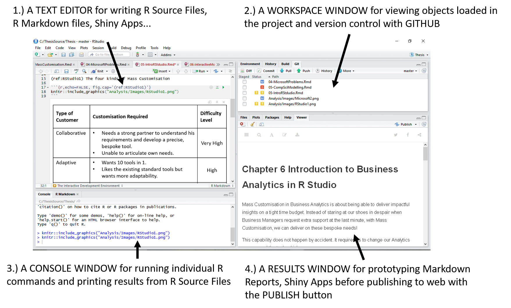
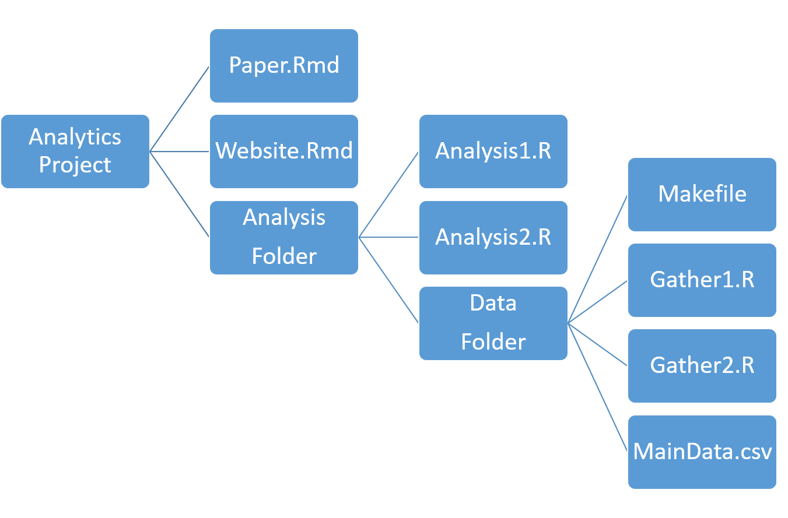

# (PART) Section 2 {-}

# Business Analytics in R Studio {#RBusinessAnalytics}

Mass Customisation in Business Analytics is about delivering impactful insights on a tight time budget. Instead of staring at our shoes in despair when Business Managers request extra support at the last minute, with Mass Customisation, we can deliver!

This capability does not happen by accident. It requires us to change our Analytics process and the tools which we use. 

In this section, I will present the Mass Customisation approach to Business Analytics and the software tool R Studio. In the next section we will see these changes deliver on a "wide range of analytics on a tight time budget".

**Mass Customisation approach to Business Analytics**

In practice, Mass Customisation requires us to correctly categorise which customer needs are important and which are not. 

Industry literature says there are four categories of customer for Analytics projects each having differing needs (see figure \@ref(fig:RStudio1)) [@harvard] [@pine1993mass]. 

(ref:RStudio1) The four kinds of Mass Customisation

```{r RStudio1,echo=FALSE, fig.cap='(ref:RStudio1)'}

```
Collaborative customers are unable to reduce their complex needs to a precise specification but demand a 100% bespoke tool. Adaptive, Transparent and Cosmetic customers are variants of a different theme. They are unhappy with isolated aspects of standardised tools and request changes.

Industry literature recommends a different customisation approach for each of these customer categories. For a Collaborative Customer, an iterative consultation process over an extended period is recommended. All aspects of the tool might be customised. Adaptive, Transparent and Cosmetic customers require an agile, targetted approach. Specific aspects of existing tools must be modified whilst leaving others unchanged.

To summarise, Mass Customisation requires us to accurately identify our client's needs. In practice this means, categorising customers into four types and taking a different customisation approach for each.

**R Studio as a Mass Customisation tool**

Whilst the case studies in the following section demonstrate the capabilities of R Studio as an Analytics tool. There are three design principles which make it so special. An Interactive Development Environment, The Reproducible Research Workflow and the R expression Language. Lets take a look:

**The Interactive Development Environment (IDE)**

The IDE gives you complete control of all aspects of an Analytics project. This enables the user to meet the needs of Adaptive, Transparent and Cosmetic customers (see figure \@ref(fig:RStudio2)). 

(ref:RStudio2) The R Studio Interactive Development Environment.

```{r RStudio2,echo=FALSE, fig.cap='(ref:RStudio2)'}

```
In the Text Editor you can write R Source files to define custom functions, statistical models, data manipulation procedures. 

Using the Workspace window these Source Files can be saved into folders with Version control. Changes are then tracked and accepted/rejected using the GitHUB system.

The Results Window allows prototyping and publishing to the web of a wide range of objects. This includes R Markdown reports and Shiny Apps.

**The Reproducible Research Workfow**

Reproducible Research is a massive theme in the Academic Research Community. For my purposes it is vital for meeting the needs of Collaborative customers. In particular it gives a structure for building complex projects in an iterative manner.

The Reproducuble Research workflow means capturing everything in an Analytics Project. Everything about data-capture, data analysis through to final report must be documented and performed programmatically. 

In R Studio you can do Reproducible Research by structuring your projects in a modular manner (see figure \@ref(fig:RStudio3)) [@gandrud2013reproducible]. 

(ref:RStudio3) The Reproducible Research Workflow

```{r RStudio3,echo=FALSE, fig.cap='(ref:RStudio3)'}

```

Source files are separated by purpose (eg. Data capture and manipulation, Analysis, Report) and each source file typically performs just one function (eg. one chart per Analysis.R file).you can structure your projects in a modular manner. 

**The Expression Language R**

There is tonnes of material online about the programming language R, so I will keep this brief! It is of vital importance to Business Analytics that R is an expression language with a very simple syntax. It enables us to focus on meeting out customer's needs rather than on writing difficult code!


