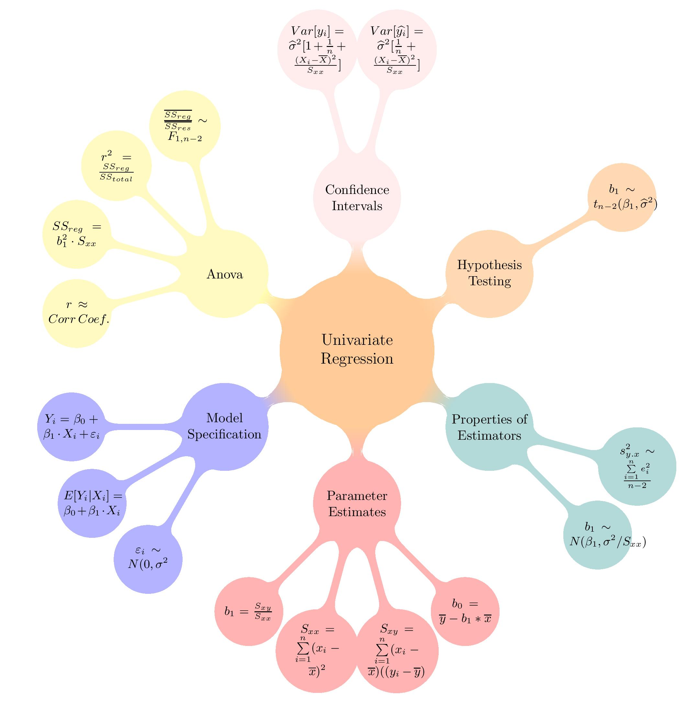
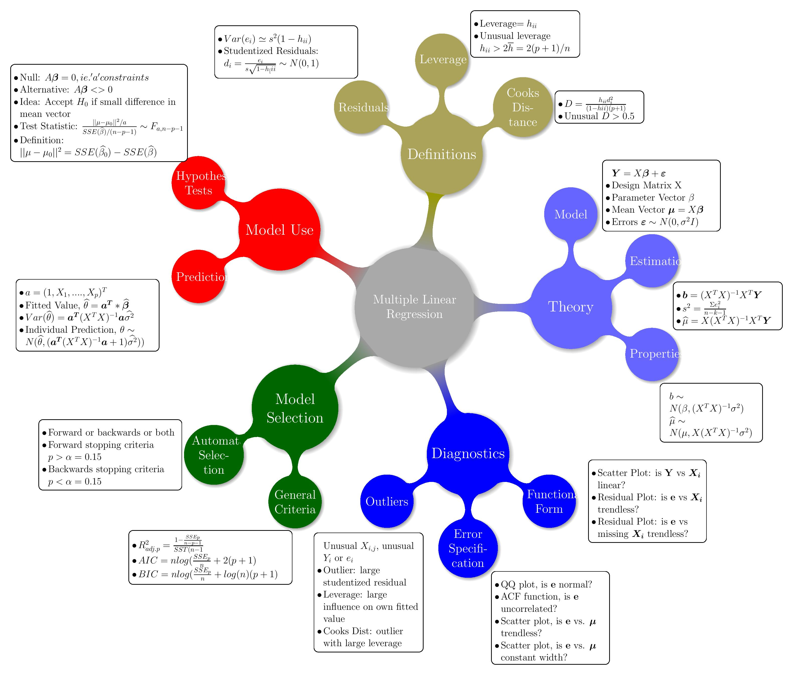

# Regression Recap {#RegressionRecap}

The case study relies on an understanding of Univariate and Multivariate regression. The mind-maps below cover the key areas and formulas:

(ref:LinearRegression1) Univariate Linear Regression

```{r LinearRegression1,echo=FALSE, fig.cap='(ref:LinearRegression1)'}

```


(ref:LinearRegression2) Multivariate Linear Regression

```{r LinearRegression2,echo=FALSE, fig.cap='(ref:LinearRegression1)'}

```


